# Relevamiento / Pre-planning — Harness de análisis de logs con IA

> Documento 0 de 5. Estado: borrador para revisión.
> Fecha: 2026-09-11 · Autor: relevamiento asistido · Owner: nico (Siainteractive)

---

## 1. Resumen ejecutivo

Se propone un repositorio único, clonable por QA, Operaciones y Desarrollo, que convierta el
análisis de logs de un ejercicio artesanal e irrepetible en un **proceso asistido, auditable y
acumulativo**.

El repo contiene tres cosas y nada más:

1. **Un harness de agentes** (`harness/`): documentación de patrones de falla, skills, subagentes
   y scripts que la IA usa para trabajar sobre los logs.
2. **Un historial de casos** (`history/`): una carpeta por incidente, con los logs crudos, las
   hipótesis probadas, la evidencia citada y el veredicto. **Todo gitignorado.**
3. **Una base de conocimiento** (`knowledge/`): los patrones de falla ya confirmados, promovidos
   desde los casos cerrados. **Esto sí se commitea** y es lo que se comparte entre las tres áreas.

La tesis central del diseño es que **el valor no está en que la IA "encuentre la causa raíz"**
—la evidencia dice que eso funciona mal (§4.2)— **sino en que reduzca el espacio de búsqueda,
cite evidencia verificable y deje un artefacto que otra persona pueda revisar y continuar.**

---

## 2. Situación actual

### 2.1 El dominio

Logs de **players de digital signage** (Dex Player) en campo. Características observadas:

| Característica | Valor observado | Implicancia de diseño |
|---|---|---|
| Tamaño por archivo | ~10 MB | Leer un archivo entero al contexto lo quema sin aportar |
| Granularidad | 1 archivo por día por equipo (`DexPlayer-YYYYMMDD.log`) | El análisis es multi-archivo por naturaleza |
| Estructura | Texto plano, timestamp al inicio de línea, prefijos `[Componente]` | Parseable con regex, no estructurado |
| Multi-app | Varios subsistemas escriben al mismo log (DataManager, StoreDataManager, player, media, red) | Hay que poder **filtrar por módulo**, no sólo por severidad |
| Anomalías conocidas | Líneas `1969-`/`1970-` en el arranque (epoch 0) que **no son error** | El ruido de dominio hay que codificarlo, no descubrirlo cada vez |
| Puntos ciegos | Equipo apagado = hueco sin registro | La ausencia de datos debe distinguirse de la ausencia de evento |

### 2.2 El activo que ya existe: `menuboard-fetch-diag`

Ya hay una skill funcionando que diagnostica por qué un template MenuBoardJS deja de refrescar
precios. **Es el prototipo de todo este proyecto y el mejor insumo de requerimientos disponible.**
Lo que enseña:

- **Funciona porque tiene procedimiento, no porque tenga modelo.** 7 pasos ordenados, comandos
  verificados contra 10 logs reales, un árbol de decisión explícito y un formato fijo de reporte
  (`VEREDICTO / CAUSA / DESDE / ACCIÓN`).
- **Tiene reglas anti-contexto codificadas**: *"Nunca leas un log completo con Read"*.
- **Define la unidad de análisis correcta** (instancia de DataManager, no montaje de template) —
  un error de unidad lleva a conclusiones falsas. Esto es conocimiento de dominio puro que ningún
  modelo infiere solo.
- **Declara limitaciones explícitas** (el bucket no es observable directamente; se acota por
  comportamiento).
- **Referencia un artefacto de caso** (`CLAUDE_FETCH_LOGS_ANALISIS.md`) — o sea, ya existe la
  intuición del "histórico por caso", sin estructura todavía.

Y lo que expone como **hueco crítico**, que este proyecto debe resolver:

- 🔴 **La firma del error es una ausencia.** El bug se detecta porque un bucket con montajes > 0
  tiene fetches = 0. Ninguna herramienta genérica de análisis de logs (Drain3, Sift, Sentry)
  detecta ausencias: todas buscan lo que está, no lo que falta. **Esto es el diferencial técnico
  del harness y debe ser una primitiva de primera clase** (§ ARQ / `loga absence`).
- 🔴 **Es bash/awk puro.** No corre en la máquina de un QA con Windows. Hoy la skill sólo la puede
  usar quien tenga WSL o Git Bash.
- 🔴 **No hay persistencia entre sesiones.** Si el análisis queda a medias, la próxima sesión
  arranca de cero.
- 🟡 **Mezcla idiomas sin criterio**: nombre y descripción en español, marcadores y código en
  inglés. Funciona, pero no escala a 20 skills. De acá sale C9/C10 y los ADR-011/012.
- 🔴 **Es una skill de un caso.** No hay forma sistemática de agregar la número 2, 3 y 20 sin que
  el conjunto se vuelva inmanejable.

### 2.3 El proceso hoy (inferido)

```mermaid
flowchart TB
  subgraph HOY["HOY · el conocimiento muere en el ticket"]
    direction LR
    N1["Reporte de<br/>QA u Operaciones"] --> N2["Alguien consigue<br/>los logs"]
    N2 --> N3["La persona que sabe bash<br/>lee 10 MB a mano"]
    N3 --> N4["Conclusión en un<br/>comentario de Jira"]
    N4 --> N5(["Fin del rastro.<br/>El caso 41 arranca de cero"])
  end

  subgraph CON["CON EL HARNESS · el conocimiento se acumula"]
    direction LR
    M1["Reporte"] --> M2["Logs a<br/>history/CASE-ID/logs/"]
    M2 --> M3["interview + triage"]
    M3 -->|"patrón conocido"| M4["Veredicto con citas<br/>verificadas"]
    M3 -->|"patrón nuevo"| M5["Hipótesis falsables<br/>+ refutación"]
    M5 --> M4
    M4 --> M6["TLDR.md + attempts.ndjson<br/>quedan en el caso"]
    M6 -->|"promote · vía PR"| M7[("knowledge/<br/>patrón reutilizable")]
  end

  M7 -.->|"el triage lo consulta<br/>ANTES de investigar"| M3
```

> **Cómo leer el diagrama.** La diferencia no está en los primeros pasos —esos son casi iguales—
> sino en las dos flechas de la derecha: hoy el flujo **termina** en el ticket; con el harness
> vuelve a entrar al sistema. Esa flecha punteada es todo el proyecto: es lo que hace que el caso
> 41 cueste menos que el 40. El resto son detalles de implementación.

Problemas concretos de este flujo:
- El análisis no es reproducible: otra persona con los mismos logs no llega al mismo lugar.
- El conocimiento no se acumula: el incidente 40 no se beneficia de los 39 anteriores.
- El cuello de botella es la persona que sabe grep, no la información.
- QA y Operaciones no pueden autoservirse; escalan todo a Desarrollo.

---

## 3. Actores y necesidades

| Actor | Qué necesita | Qué NO necesita | Fricción máxima tolerable |
|---|---|---|---|
| **QA** | Decidir en 10 min si lo que ve es un bug conocido o algo nuevo, y adjuntar evidencia al ticket | Aprender regex, awk o el layout interno de los logs | Clonar repo + `uv run` una vez |
| **Operaciones** | Saber si una pantalla en campo está afectada por un patrón conocido y cuál es la acción de remediación | Interpretar stack traces | Copiar logs a una carpeta y correr un comando |
| **Desarrollo** | Ir de "está roto" a "la línea que lo explica" sin leer 10 MB; y dejar el análisis versionado para el post-mortem | Ceremonia de documentación | Lo que ya paga hoy |
| **La IA (Claude Code / otros)** | Un procedimiento explícito, herramientas con salida acotada y un lugar donde persistir estado | Acceso a los logs crudos completos | — |

**Riesgo de adopción #1** (evidencia: Honeycomb, 39% de adopción en el tier donde la feature no se
veía): si esto vive sólo en un CLI que hay que instalar y recordar, se muere. El diseño tiene que
apuntar a **tiempo hasta el primer valor < 5 minutos** desde el clone.

---

## 4. Evidencia de la investigación (qué dice el estado del arte)

### 4.1 Lo que sí funciona

| Hallazgo | Fuente | Consecuencia de diseño |
|---|---|---|
| **El agente debe *consultar* los logs con herramientas, no recibirlos.** Accuracy de RCA: 3.88% leyendo telemetría cruda vs **11.34%** escribiendo código para analizarla. **3x.** | OpenRCA, ICLR 2025 | Decisión arquitectónica de mayor impacto de todo el proyecto |
| **Más contexto crudo empeora el diagnóstico.** Logs crudos: score 0.353 @ 275k tokens. Híbrido `head + grep(primer error ±K) + tail`: **0.670 @ 19.8k tokens**. 14× menos tokens, casi el doble de calidad | LogDx-CI | El modo por defecto de extracción de evidencia es el híbrido |
| **En modo agente con tool-use, la diferencia entre métodos de reducción colapsa 7×** (spread 0.42 → 0.059) | LogDx-CI | El resumen inicial no tiene que ser perfecto; tiene que ser **honesto sobre lo que omitió** y permitir pedir más |
| **Template mining reduce 10³–10⁶ : 1.** HDFS: 11.2M líneas → decenas de templates. Apache: 56.500 líneas → **4** templates | LogHub / Drain3 | Drain3 como motor de resumen. `pip install drain3` |
| **Drain gana en grouping accuracy y es de los pocos que termina a escala** (9 de 15 parsers no procesaron los datasets en 12h) | ISSTA'24 "How Far Are We?" | No meter parsers semánticos con GPU |
| **Analyzers determinísticos primero, LLM después.** El LLM traduce y explica; las reglas detectan | k8sgpt, Grafana Sift | Los playbooks de dominio son reglas, no prompts |
| **Hipótesis múltiples con estado validada/invalidada/inconcluyente** | Datadog Bits AI SRE | El output no es "una respuesta", es "una investigación" |
| **Cita obligatoria archivo:línea** | Datadog + papers de injection | Doble beneficio: anti-alucinación y anti-inyección |
| **Los incidentes generan ground truth solos al cerrarse** ("time travel evaluation") | incident.io | Guardar cada análisis con su causa real desde el día 1 habilita evaluación gratis |

### 4.2 Lo que NO funciona (y hay que diseñar en contra)

| Anti-patrón | Evidencia | Mitigación adoptada |
|---|---|---|
| **Creer que la IA da la causa raíz** | OpenRCA: **11.34% de accuracy máxima** en RCA end-to-end. Ningún modelo acertó componente+momento+causa simultáneamente, nunca. La accuracy cae a la mitad al pasar de 1 a 2 elementos requeridos | El producto se posiciona como *"reduce el espacio de búsqueda y da evidencia citada"*, jamás como *"te dice qué pasó"*. Banner permanente en todo output |
| **Alucinación de causas plausibles** | Zalando, 2 años de postmortems con IA: hasta 40% de alucinación con modelos chicos, **~10% de error de atribución** con modelos avanzados | Verificación determinística de citas (script, no LLM). Sin cita válida, la afirmación no se renderiza |
| **Volcar logs al contexto "porque entra"** | Context Rot (Chroma, 18 modelos): degradación universal. **Hallazgo clave: los haystacks coherentes rinden PEOR que los aleatorios** — un log es narrativa coherente, o sea el peor caso | El agente nunca recibe archivos completos. Presupuesto duro de tokens por comando |
| **Sicofancia / sesgo de confirmación** | Documentado bajo rebuttal del usuario: el modelo cede ante la presión aun teniendo razón | **La hipótesis del humano se registra pero se sella**: no entra al turno de generación de hipótesis |
| **Compresión estructural como reducción** | LogZip: GPTScore 0.41 / exact-match 20%. **Peor que borrar líneas al azar** (0.86 / 70%) | Filtrado consciente de RCA, nunca compresión ciega |
| **Reducción mala > ninguna reducción** | `rtk-log` standalone: **13.3% de tasa de error confiado** | Toda reducción declara qué omitió |
| **Asumir reproducibilidad con temperature=0** | El no-determinismo es del servidor (falta de batch-invariance), no del sampling. **Dos personas corriendo "el mismo análisis" obtienen textos distintos** | Se persiste el **artefacto**, no el chat. La capa de evidencia es determinística y regenerable sin LLM |
| **Ignorar prompt injection desde los logs** | 4 papers en 2026. ASR 83-88% sin defensas. **Los guardrails de AWS, GCP y Azure fallaron todos.** Cualquier usuario anónimo puede inyectar porque los mensajes de error incluyen el input que los disparó | Agente **read-only, sin ejecución de acciones**. Prompt "passive" explícito (bajó la mayoría de modelos a 0%). Todo contenido de log delimitado como dato |
| **Ceremonia desproporcionada** | Spec Kit: un bugfix generó "4 user stories con 16 criterios de aceptación". *"I'd rather review code than all these markdown files"* | **Camino rápido obligatorio**: un caso trivial se cierra con 2 archivos |
| **Estado declarado a mano que se desincroniza** | BMAD: status manual + issue #1930 (reescribe historias completadas) | **Estado derivado** de qué archivos existen, nunca un campo escrito a mano. Histórico append-only |

### 4.3 Frameworks de persistencia evaluados

| Framework | Qué copiar | Qué evitar |
|---|---|---|
| **OpenSpec** (la referencia que pediste) | La separación `specs/` (verdad acumulada) vs `changes/` (trabajo en vuelo) + **merge al archivar**. El estado derivado de artefactos en disco + DAG de dependencias. El contrato JSON agente↔CLI (un documento JSON por invocación, prosa a stderr) | El parseo estricto que falla en silencio (3 vs 4 `#`). La superficie de CLI que creció hasta contradecir el "easy, not complex" original |
| **Beads** | JSONL append-only como fuente de verdad + índice derivado. Cero merge conflicts. Estado `ready` computado | — |
| **BMAD** | El story file con secciones fijas que separan *plan* de *registro de ejecución* ("Stateless Agents, Stateful Documents") | Status manual; histórico mutable |
| **Agent OS** | `index.yml` con **reglas de detección**: cuándo cargar cada pieza de conocimiento. `spec-lite.md`: versión condensada al lado de la completa | Rupturas entre versiones |
| **Task Master** | El cálculo de "siguiente acción" desde el grafo | JSON monolítico → merge conflicts brutales e ilegible en PR |
| **ADRs** | **Nunca se editan, se supersedean.** Histórico inmutable por diseño | — |

---

## 5. Restricciones

| # | Restricción | Origen | Impacto |
|---|---|---|---|
| C1 | **Windows + Linux/Mac mixto** | Respuesta del relevamiento | Descarta bash puro. Descarta `lnav`, `GoAccess` (sin build Windows) |
| C2 | **Todo lo generado por análisis va gitignorado** | Requerimiento explícito | El conocimiento compartible necesita un canal separado y **curado** |
| C3 | **Logs con datos potencialmente sensibles** (IPs, IDs de tienda, precios de cliente) | Dominio | Nada de logs a git. Redacción opcional antes de mandar a LLM |
| C4 | **Soporte Claude Code (CLI + VSCode) y otros agentes vía AGENTS.md** | Respuesta del relevamiento | Fuente única de instrucciones, wrappers finos por agente |
| C5 | **QA y Operaciones no son técnicos** | Actores | Comandos de una línea, salida en lenguaje llano, cero regex a mano |
| C6 | **El harness tiene que estar contenido en una carpeta** | Requerimiento explícito | Tensión con `.claude/` en la raíz (que Claude Code exige). Ver ADR-003 |
| C7 | Claude Code **no lee `AGENTS.md`** nativamente | Docs oficiales | `CLAUDE.md` importa `@AGENTS.md` (el symlink no es confiable en Windows) |
| C8 | Límite de facto ~25.000 tokens por resultado de tool | Ecosistema MCP/Claude Code | Presupuesto duro por comando + envelope de truncación |
| C9 | **Todo identificador del repo en inglés** (carpetas, archivos, comandos, claves, estados, slugs) | Decisión de equipo | Convención documentada y verificable (ADR-012). La prosa queda en español |
| C10 | **Los usuarios finales trabajan y reportan en español** | Actores | La salida del harness es español por defecto, con detección de idioma (ADR-011). Los triggers de skills deben contener frases en español o no disparan |

---

## 6. Supuestos a validar

| # | Supuesto | Cómo validarlo | Si es falso |
|---|---|---|---|
| A1 | Los logs llegan como archivos que alguien copia a una carpeta (no hay acceso programático a una plataforma) | Preguntar a Operaciones | Si hay API/S3, se agrega un `loga fetch` y cambia el journey de intake |
| A2 | Existen ~5-15 patrones de falla recurrentes ya reconocidos | Inventario con QA/Ops/Dev | Si son 100, `knowledge/` necesita índice con detección desde el día 1 |
| A3 | El formato de línea de log es estable entre versiones del player | Muestrear logs de 6 meses | El parser necesita versionado por formato |
| A4 | El equipo acepta instalar `uv` (un comando) | Piloto con 1 QA | Fallback: binario compilado o venv pre-armado |
| A5 | Hay al menos 10 incidentes históricos con causa conocida para backtesting | Revisar Jira | Sin ground truth no se puede medir precision → el gate de calidad se vuelve cualitativo |
| A6 | Los logs no contienen PII de consumidores finales | Muestrear y escanear | Redacción pasa de opcional a obligatoria (bloqueante) |

---

## 7. Preguntas abiertas (decidir antes de Fase 1)

1. **¿Los logs vienen sólo del player o también hay logs de backend correlacionables?** Si hay
   backend, existe un `correlation_id` cruzable y eso multiplica el valor del harness
   (`trace <id>` es la reducción de mejor ratio señal/token que existe).
2. **¿Cuál es el tope de casos concurrentes por persona?** Define si `history/` necesita índice.
3. **¿Se quiere integración con Jira** (leer el ticket, escribir el veredicto) o basta con
   copiar-pegar? Un MCP de Jira es Fase 3, pero cambia el diseño del `export`.
4. **¿Hay un repositorio de código del player accesible desde el mismo entorno?** La skill actual
   cita `src/managers/data-manager/base.ts:85-106` — si el código está a mano, el agente puede
   verificar hipótesis contra la implementación, no sólo contra los logs. Esto sube mucho la calidad.
5. **¿Cuántas personas y con qué frecuencia?** Define si vale la pena el CLI o alcanza con skills.
6. **¿Qué modelo/plan de Claude Code usan?** Define presupuestos de tokens y si conviene routear
   los pasos baratos a un modelo chico.

---

## 8. Criterios para decir que esto funcionó

| Métrica | Baseline hoy | Objetivo Fase 1 | Objetivo Fase 3 |
|---|---|---|---|
| Tiempo de "tengo los logs" a "tengo un veredicto con evidencia" | Horas / no medido | < 30 min para un patrón conocido | < 10 min |
| % de casos donde QA/Ops llega solo, sin escalar a Desarrollo | ~0% | 30% | 60% |
| % de afirmaciones del informe con cita `archivo:línea` verificada | 0% | **100%** (gate duro) | 100% |
| Precision sobre backtest de incidentes conocidos | — | ≥ 70% | **≥ 80%** (target de incident.io; por debajo de 70% la herramienta hace perder tiempo durante un incidente) |
| Patrones en `knowledge/` | 1 (menuboard) | 5 | 15 |
| Casos donde el agente dice "no sé, necesito X" en vez de inventar | — | Medible y celebrado | — |

**Nota sobre precision vs recall**: se prioriza precision. Un falso positivo daña activamente
(manda a alguien a perseguir una causa falsa durante un incidente); un falso negativo sólo deja el
flujo normal como está.

---

## 9. Lo que este proyecto NO es

- ❌ No es una plataforma de observabilidad. No ingiere en tiempo real, no alerta, no tiene UI.
- ❌ No es un reemplazo de Datadog / Grafana / Sentry.
- ❌ No decide ni ejecuta remediaciones. Es **read-only** por diseño de seguridad (§4.2, injection).
- ❌ No es un servicio: es un repo que cada persona clona y corre local.
- ❌ No promete causas raíz. Promete evidencia citada y reducción del espacio de búsqueda.
