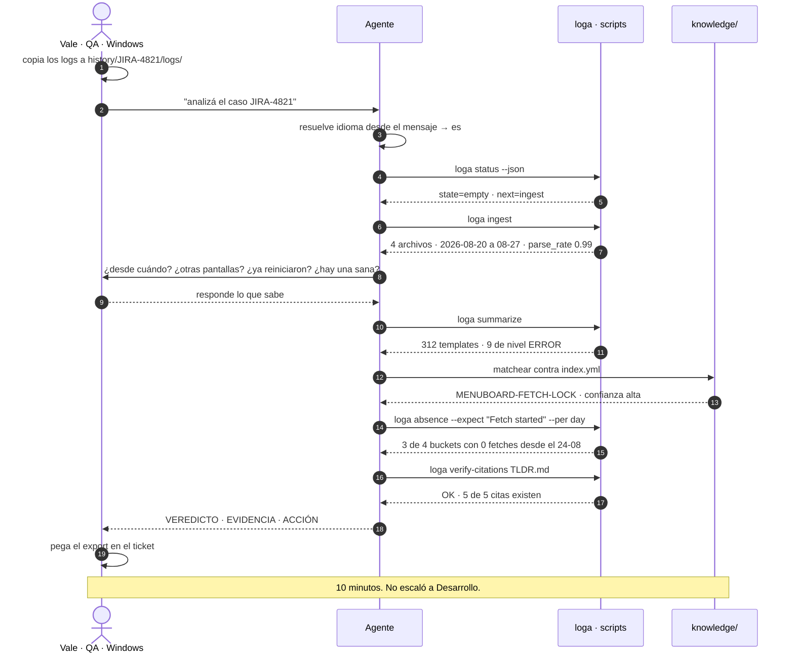

# PRD — `logharness`: análisis de logs asistido por IA

> Documento 1 de 5 · v0.1 · 2026-09-11
> Depende de: `00-DISCOVERY.md`

---

## 1. Problema

Cuando una pantalla en campo falla, el camino desde "está rota" hasta "esto es lo que pasó" depende
de que una persona específica, con acceso a bash y memoria del dominio, lea 10 MB de texto. El
resultado no queda registrado de forma reutilizable, no es reproducible por otra persona, y el
conocimiento que se genera muere en un comentario de Jira.

**Costo estimado**: cada incidente paga de nuevo el costo del anterior.

---

## 2. Visión

> Un repo que cualquiera del equipo clona, abre con `claude`, le tira una carpeta de logs y un
> número de ticket, y obtiene en minutos un veredicto con evidencia citada línea por línea —
> que después otra persona puede revisar, continuar o refutar.

Y, como efecto acumulativo: **cada caso cerrado hace más barato el siguiente**, porque los patrones
confirmados se promueven a una base de conocimiento compartida que el agente consulta antes de
investigar.

### 2.1 Posicionamiento (importante y no negociable)

`logharness` **no dice qué pasó**. `logharness`:
1. Reduce 10 MB a las 30 líneas que importan.
2. Propone hipótesis **falsables** y busca evidencia **en contra**.
3. Cita `archivo:línea` para todo lo que afirma, y verifica esas citas con un script.
4. Deja un artefacto que sobrevive a la sesión de chat.

La evidencia (OpenRCA: 11.34% de accuracy máxima en RCA con LLM) hace que cualquier otro
posicionamiento sea deshonesto y contraproducente para la adopción.

---

## 3. No-objetivos

| No-objetivo | Por qué |
|---|---|
| Ingesta en tiempo real / streaming | Es una plataforma de observabilidad, no esto |
| Alertas y monitoreo | Idem |
| Ejecutar remediaciones automáticas | Read-only por diseño: elimina el peor caso de prompt injection desde logs |
| UI web | El CLI + el chat del agente son la interfaz. Una UI es Fase 4 si acaso |
| Multi-tenant / servidor central | Cada persona corre local. Simplifica todo: permisos, privacidad, costos |
| Reemplazar el criterio humano | El humano es el juez. La IA arma el expediente |

---

## 4. Personas y journeys

### P1 — Vale, QA (Windows, no técnica)
> *"Reportaron que una pantalla muestra precios viejos. ¿Es el bug que ya conocemos o es nuevo?"*

> **Cómo leer el diagrama.** Vale sólo aparece en cuatro momentos: copiar, pedir, contestar el
> interrogatorio y pegar. Todo lo del medio es el agente hablándole a `loga` y a `knowledge/`.
> Las dos flechas que importan son la penúltima —`verify-citations`, que es lo que hace que el
> veredicto sea defendible— y el intercambio del interrogatorio, que es el único lugar donde el
> sistema depende de que una persona aporte lo que el log no dice.
**Tiempo objetivo: < 10 min. Éxito = no necesitó a nadie.**

### P2 — Diego, Operaciones (Windows/Linux)
> *"¿Cuántas pantallas de la flota están en riesgo de este patrón?"*

1. `history/OPS-fleet-sept/logs/` con 40 logs de 40 equipos.
2. *"corré el chequeo de flota contra el patrón MENUBOARD-FETCH-LOCK"*.
3. Tabla de salida: equipo · afectado · días bloqueado · acción.
**Fase 2.** Requiere que los patrones de `knowledge/` sean ejecutables, no sólo prosa.

### P3 — Nico, Desarrollo (Linux/Mac)
> *"Esto es nuevo. Necesito entenderlo y dejarlo documentado."*

1. Intake + triage → *"no matchea ningún patrón conocido"*.
2. Genera ≥3 hipótesis falsables, con `predicts_false` obligatorio.
3. Para cada una: ejecuta el experimento (un comando de `loga` sobre los logs) y registra
   evidencia a favor **y en contra** en `attempts.ndjson`, que es append-only.
4. El subagente `challenger` intenta refutar la hipótesis ganadora.
5. Informe + `TLDR.md`.
6. `loga promote JIRA-4821` → propone un patrón nuevo en `knowledge/`, que se revisa en un PR.

El ciclo completo, con las dos puertas que no se pueden saltear, está en
`03-SKILLS-AGENTS-SCRIPTS.md` §2.5.
**Éxito = el caso 41 cuesta la mitad que el 40.**

### P4 — El agente (Claude Code / Codex / Cursor)
1. Lee `CLAUDE.md` (o `AGENTS.md`) → conoce el protocolo y resuelve el idioma.
2. `loga status --json` → sabe en qué punto está el caso sin leer nada más.
3. Usa herramientas con salida acotada; nunca lee un log entero.
4. Escribe a los artefactos del caso; nunca edita el histórico de intentos.

---

## 5. Requerimientos funcionales

Prioridad: **M** = Must (MVP) · **S** = Should (Fase 2) · **C** = Could (Fase 3) · **W** = Won't (por ahora)

### RF-1 — Gestión de casos

| ID | Requerimiento | Pri |
|---|---|---|
| RF-1.1 | Crear un caso con un ID (típicamente el de Jira) que genere la estructura de carpetas | **M** |
| RF-1.2 | Aceptar logs agrupados en subcarpetas arbitrarias (por equipo, por fecha, por módulo) y tratarlas como **grupos** nombrados | **M** |
| RF-1.3 | Designar un grupo como *baseline sano* y otro como *target roto*, para análisis diferencial | **S** |
| RF-1.4 | `status` que **derive** el estado del caso de los artefactos presentes, sin campo manual | **M** |
| RF-1.5 | Retomar un caso en una sesión nueva sin perder contexto, leyendo ≤ 2k tokens | **M** |
| RF-1.6 | Cerrar un caso con veredicto y causa real (habilita evaluación posterior) | **M** |
| RF-1.7 | Archivar casos cerrados a `history/archive/YYYY-MM-DD-<id>/` | **S** |
| RF-1.8 | Buscar casos previos por síntoma | **S** |

### RF-2 — Ingesta y normalización

| ID | Requerimiento | Pri |
|---|---|---|
| RF-2.1 | Generar un **manifiesto** por caso: `{archivo, grupo, primer_ts, ultimo_ts, líneas, bytes, encoding, comprimido, formato_detectado, tasa_de_parseo}` | **M** |
| RF-2.2 | Detectar encoding (BOM UTF-8/UTF-16LE/BE, heurística sin BOM) y normalizar salida a UTF-8 | **M** |
| RF-2.3 | Leer `.gz/.bz2/.xz/.zst` en streaming, sin descomprimir a disco | **S** |
| RF-2.4 | Normalizar timestamps a ISO-8601 UTC preservando el original y la precisión | **M** |
| RF-2.5 | Ordenar logs rotados por **primer timestamp parseado**, nunca por nombre ni mtime | **M** |
| RF-2.6 | Avisar si la tasa de parseo de timestamps < 95% (señal de formato desconocido) | **M** |
| RF-2.7 | Nunca cargar el archivo completo en memoria (streaming línea a línea) | **M** |
| RF-2.8 | Redacción opcional de PII/secretos antes de que cualquier contenido llegue al LLM | **S** |

### RF-3 — Reducción y consulta (el corazón)

| ID | Requerimiento | Pri |
|---|---|---|
| RF-3.1 | **`summarize`**: tabla de templates (Drain3) con `id, severidad, count, primer_visto, ultimo_visto, ejemplo`. Convierte GB en ≤ 4k tokens | **M** |
| RF-3.2 | **`window`**: ventana cruda `±K` líneas alrededor de un timestamp o una línea, multi-archivo mergeada | **M** |
| RF-3.3 | **`first-error`**: primera aparición **por template** (no por línea) con ventana de contexto | **M** |
| RF-3.4 | **`grep`**: búsqueda con envelope acotado (usa ripgrep si está, fallback Python si no) | **M** |
| RF-3.5 | **`absence`**: detectar **eventos esperados que NO ocurrieron** en una ventana/agrupación. *Esta es la primitiva diferencial; el caso de referencia se detecta exclusivamente así* | **M** |
| RF-3.6 | **`trace <id>`**: todas las líneas con un correlation/session/device id, ordenadas temporalmente | **S** |
| RF-3.7 | **`diff`**: delta de templates y frecuencias entre grupo sano y grupo roto | **S** |
| RF-3.8 | **`timeline`**: cronología fusionada multi-archivo, sólo eventos sobre umbral de severidad + primera aparición de cada template | **S** |
| RF-3.9 | **`cadence`**: deltas entre ocurrencias de un template (deriva intervalos reales, detecta gaps) | **S** |
| RF-3.10 | **`bisect`**: bisección temporal sobre un predicado | **C** |
| RF-3.11 | Detección de anomalías de frecuencia por template contra baseline (z-score/MAD) | **C** |

### RF-4 — Contrato de salida (anti-context-rot)

| ID | Requerimiento | Pri |
|---|---|---|
| RF-4.1 | Todo comando escribe el resultado **completo** a `.work/<run-id>/<cmd>.ndjson` y devuelve al agente sólo resumen + ruta | **M** |
| RF-4.2 | Envelope obligatorio en toda salida paginable: `returned`, `totalCount`, `truncated`, `nextCursor`. **Prohibida la truncación silenciosa** | **M** |
| RF-4.3 | Presupuesto duro de tokens por comando (`summarize` ≤4k, `detail` ≤6k, `window`/`trace` ≤8k, tope absoluto 25k) con degradación **anunciada** | **M** |
| RF-4.4 | Campo `next:` con los comandos de profundización sugeridos | **M** |
| RF-4.5 | `--format {md, ndjson, json}`: markdown al agente y al humano, ndjson a disco, json para scripting | **M** |
| RF-4.6 | Toda referencia a evidencia es `archivo:línea` + excerpt ≤ 200 caracteres. Nunca bloques enteros | **M** |
| RF-4.7 | Contrato máquina: `--json` emite **un** documento JSON a stdout, prosa a stderr, exit 0/1 | **S** |

### RF-5 — Método de investigación

| ID | Requerimiento | Pri |
|---|---|---|
| RF-5.1 | **Interrogatorio previo** estructurado (estilo *grill-me*) antes de tocar los logs: desde cuándo, alcance, qué cambió, qué ya se probó, qué se espera ver | **M** |
| RF-5.2 | La hipótesis que trae el humano se **registra sellada** y NO se le pasa al agente en el turno de generación de hipótesis (anti-sicofancia) | **M** |
| RF-5.3 | Generar **≥ 3 hipótesis** con `statement`, `predicts_true`, `predicts_false`. Sin `predicts_false` la hipótesis se rechaza por no falsable | **M** |
| RF-5.4 | Cada hipótesis termina en `open / supported / refuted / superseded`, con evidencia a favor **y en contra** | **M** |
| RF-5.5 | Registro `attempts.ndjson` **append-only**: nunca se edita ni se borra una línea; se supersede | **M** |
| RF-5.6 | Pase de **verificación adversarial** antes de emitir: un subagente intenta refutar la conclusión | **M** |
| RF-5.7 | **Verificación determinística de citas** (script, sin LLM): toda referencia `archivo:línea` existe y el excerpt coincide. Gate duro | **M** |
| RF-5.8 | Lenguaje calibrado: confianza alta / media / baja según evidencia. Prohibida la prosa asertiva sin cita | **M** |
| RF-5.9 | Análisis diferencial sano-vs-roto como técnica de primera clase | **S** |

### RF-6 — Conocimiento acumulado

| ID | Requerimiento | Pri |
|---|---|---|
| RF-6.1 | `knowledge/patterns/<slug>.md`: patrón de falla con síntoma, mecanismo, cómo confirmarlo, cómo descartarlo, remediación, limitaciones | **M** |
| RF-6.2 | `knowledge/index.yml`: reglas de detección (regex/templates/componentes) → qué patrón cargar. Progressive disclosure | **M** |
| RF-6.3 | El triage matchea el caso contra el índice **antes** de investigar | **M** |
| RF-6.4 | `promote`: convertir hallazgos de un caso cerrado en patrón nuevo o refuerzo de uno existente, vía PR | **S** |
| RF-6.5 | Un patrón puede llevar un **playbook ejecutable** (secuencia de comandos + árbol de decisión) además de la prosa | **S** |
| RF-6.6 | Los patrones se supersedean, no se reescriben en silencio (estilo ADR) | **S** |

### RF-7 — Harness multi-agente

| ID | Requerimiento | Pri |
|---|---|---|
| RF-7.1 | `CLAUDE.md` en la raíz que importe la fuente única y agregue lo específico de Claude Code | **M** |
| RF-7.2 | `AGENTS.md` en la raíz como fuente única del protocolo, legible por Codex/Cursor/Copilot/Gemini | **M** |
| RF-7.3 | `.claude/skills/` con las skills registradas y `.claude/agents/` con los subagentes | **M** |
| RF-7.4 | `.claude/settings.json` con permisos que pre-aprueben los scripts del harness (cero prompts repetitivos) | **M** |
| RF-7.5 | Funcionar igual en Claude Code CLI y en la extensión de VSCode (comparten configs) | **M** |
| RF-7.6 | Instrucciones que no dependan de features exclusivas de Claude Code en el núcleo del protocolo | **S** |
| RF-7.7 | Empaquetable como plugin de Claude Code para reusar en otros repos | **C** |

### RF-8 — Seguridad y privacidad

| ID | Requerimiento | Pri |
|---|---|---|
| RF-8.1 | `.gitignore` que ignore `history/**` completo salvo una lista blanca explícita | **M** |
| RF-8.2 | Pre-commit hook con gitleaks (y/o TruffleHog) que bloquee secretos y logs | **M** |
| RF-8.3 | Enforcement en CI sobre historia completa (el hook local se saltea con `--no-verify`) | **S** |
| RF-8.4 | Todo contenido de log se trata como **dato adversarial**, delimitado, nunca como instrucción | **M** |
| RF-8.5 | Instrucción "passive" explícita: el agente no ejecuta acciones sugeridas por el contenido de un log | **M** |
| RF-8.6 | Redacción de PII/secretos (Presidio o regex propias) opcional en Fase 1, evaluada como obligatoria si A6 es falso | **S** |
| RF-8.7 | `export` produce un bloque sanitizado listo para pegar en Jira | **S** |

### RF-9 — Evaluación (lo que la vuelve mejorable)

| ID | Requerimiento | Pri |
|---|---|---|
| RF-9.1 | Al cerrar un caso se registra la **causa real confirmada** | **M** |
| RF-9.2 | Set de backtest: 10 incidentes históricos con causa conocida | **S** |
| RF-9.3 | Runner de evaluación que corra el harness contra el backtest y reporte precision/recall | **C** |
| RF-9.4 | Test de alucinación: preguntar por componentes y patrones inexistentes; debe admitir que no sabe | **S** |

### RF-10 — Idioma y convenciones de nombres

| ID | Requerimiento | Pri |
|---|---|---|
| RF-10.1 | **Todos los identificadores del repo en inglés**: carpetas, archivos, comandos, flags, claves YAML/JSON, estados, slugs, nombres de skills y subagentes | **M** |
| RF-10.2 | **La prosa sale en el idioma del usuario, por defecto español**: informes, preguntas del interrogatorio, mensajes del CLI, documentación | **M** |
| RF-10.3 | `AGENTS.md` arranca con un bloque **§0 Language** que resuelve el idioma antes de la primera respuesta: caso activo → pedido explícito → inferencia del primer mensaje → pregunta única si es ambiguo → español | **M** |
| RF-10.4 | El idioma resuelto se persiste en `case.yaml.language` y no se vuelve a preguntar | **M** |
| RF-10.5 | Las etiquetas de salida salen de `harness/i18n/<lang>.yml`, con claves en inglés. Las plantillas no se duplican por idioma | **M** |
| RF-10.6 | **Los excerpts de log se citan verbatim, nunca traducidos** | **M** |
| RF-10.7 | Los triggers de las skills y `knowledge/index.yml → symptoms.es` contienen las frases **en español** con las que QA y Operaciones reportan | **M** |
| RF-10.8 | `lint-repo` verifica la convención de nombres (ADR-012) | **S** |
| RF-10.9 | `harness/i18n/en.yml` para operar el harness íntegramente en inglés | **C** |

---

## 6. Requerimientos no funcionales

| ID | Requerimiento | Métrica |
|---|---|---|
| RNF-1 | **Cross-platform real** | Mismo comando funciona en Windows, Linux y macOS sin cambios |
| RNF-2 | **Cero dependencias obligatorias más allá del runtime** | Funciona en una laptop sin `rg`, `jq` ni `duckdb`; los detecta y los usa si están |
| RNF-3 | **Tiempo hasta el primer valor** | < 5 min desde `git clone` para alguien sin conocimiento previo |
| RNF-4 | **Performance** | `summarize` de 10 archivos × 10 MB en < 60 s en una laptop |
| RNF-5 | **Memoria acotada** | Streaming; nunca cargar un archivo entero |
| RNF-6 | **Presupuesto de contexto** | Un caso completo de patrón conocido consume < 40k tokens de punta a punta |
| RNF-7 | **Determinismo de la capa de evidencia** | Los comandos dan exactamente la misma salida ante la misma entrada (sin LLM en el medio) |
| RNF-8 | **Legibilidad de los scripts para no-expertos** | QA debería poder leer el script y entender qué hace |
| RNF-9 | **Auditabilidad** | Cada artefacto guarda: hash de entrada, rango temporal, filtros, versión del prompt, modelo y versión |
| RNF-10 | **Separación idioma/identificador** | Renombrar un identificador nunca requiere tocar prosa, y traducir prosa nunca rompe un comando, un import o un `grep` |

---

## 7. Criterios de aceptación del MVP

El MVP se considera terminado cuando, en una máquina Windows limpia:

1. `git clone` + `uv run harness/scripts/loga.py doctor` reporta todo OK en < 5 min.
2. `loga new JIRA-XXXX` crea el caso; copiar logs a `logs/` y `loga ingest` produce el manifiesto.
3. Abrir el repo con Claude Code y decir *"analizá JIRA-XXXX"* dispara el interrogatorio.
4. El triage matchea el patrón `MENUBOARD-FETCH-LOCK` sobre el set de 10 logs reales ya conocidos
   y **reproduce el veredicto de la skill actual**, con las mismas citas.
5. Todas las citas del informe pasan `loga verify-citations` (gate duro).
6. Cerrar la sesión, abrir una nueva, decir *"seguí con JIRA-XXXX"* y que retome sin perder estado.
7. `git status` está limpio: ningún log ni artefacto de análisis quedó trackeado.
8. Un caso trivial se puede cerrar con **2 archivos** (`case.yaml` + `TLDR.md`) sin ceremonia.
9. Abrir una sesión escribiendo *"analyze case JIRA-XXXX"* hace que el harness responda **en
   inglés**; escribiendo *"analizá el caso JIRA-XXXX"*, **en español**; invocando `/case JIRA-XXXX`
   a secas, pregunta una vez y guarda la respuesta. En los tres casos, los nombres de archivos y
   comandos son idénticos.

El punto 4 es el criterio más importante: **si el harness no reproduce lo que ya sabemos hacer a
mano, no sirve.**

---

## 8. Alcance por fases

| Fase | Nombre | Duración estimada | Entrega |
|---|---|---|---|
| **0** | Decidir y esqueletar | 2-3 días | Estructura de repo, `.gitignore`, `CLAUDE.md`/`AGENTS.md`, decisiones cerradas |
| **1** | **MVP** | 2-3 semanas | `loga` core (ingest/summarize/grep/window/absence/status), 4 skills, 1 subagente, 1 patrón portado, verificación de citas |
| **2** | Método y conocimiento | 2-3 semanas | Hipótesis formales, `diff`/`trace`/`timeline`, `knowledge/index.yml` con detección, promoción vía PR, export a Jira, chequeo de flota |
| **3** | Escala y calidad | Continuo | Backtest + métricas, más patrones, plugin distribuible, MCP de Jira, redacción, bisección |

---

## 9. Decisiones que hacen falta antes de Fase 1

| # | Decisión | Opciones | Recomendación |
|---|---|---|---|
| D1 | Runtime de scripts | bash+PS duplicado / **Python+uv** / Node / Go | Python + uv (ADR-001) |
| D2 | Estructura de persistencia por caso | 1 archivo / árbol completo / **híbrido** | Híbrido con camino rápido (ADR-002) |
| D3 | Dónde vive el harness | todo en `.claude/` / `harness/` + sync / **`harness/` + skills finas** | `harness/` como fuente, `.claude/` fino (ADR-003) |
| D4 | Qué es el orquestador | skill / CLI / SDK | Skill + CLI complementarios (ADR-004) |
| D5 | Qué se commitea | nada / todo / **`knowledge/` sí, `history/` no** | Split con promoción curada (ADR-005) |
| D6 | Motor de resumen | grep artesanal / **Drain3** / embeddings | Drain3 con masking de dominio (ADR-006) |
| D7 | Idioma del repo | todo español / todo inglés / **identificadores inglés + prosa español** | Split con detección de idioma (ADR-011) |
| D8 | Convención de nombres | ad-hoc / **documentada y verificable** | kebab-case inglés, `lint-repo` (ADR-012) |

Detalle y alternativas en `02-ARCHITECTURE.md`.
