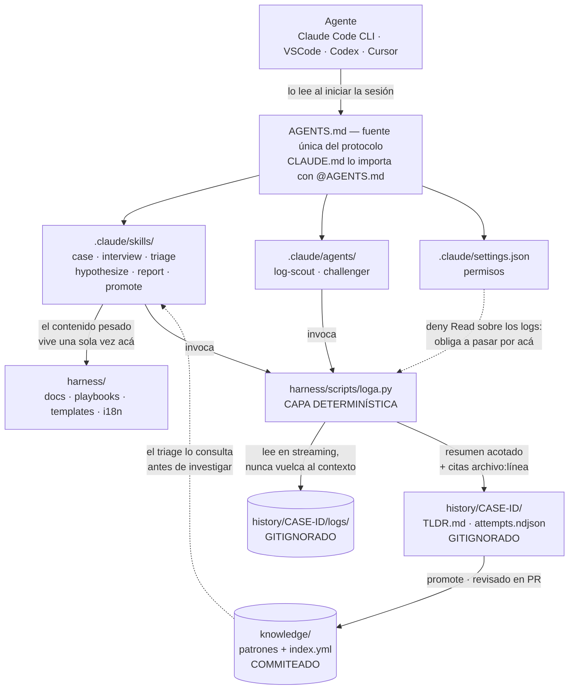
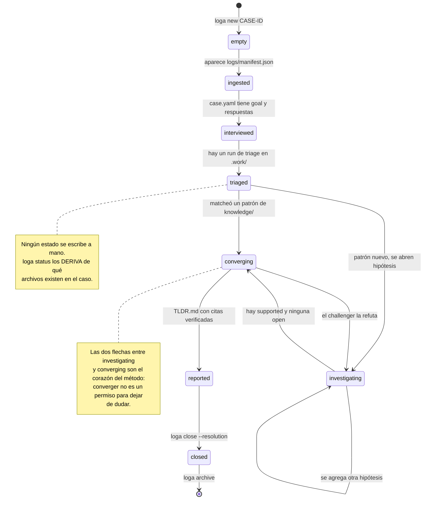
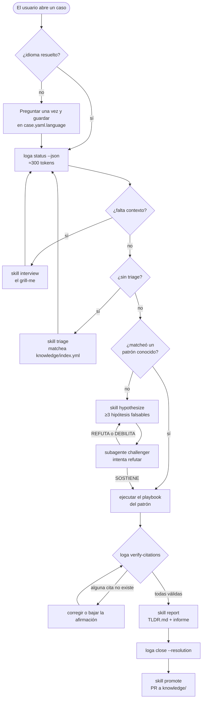
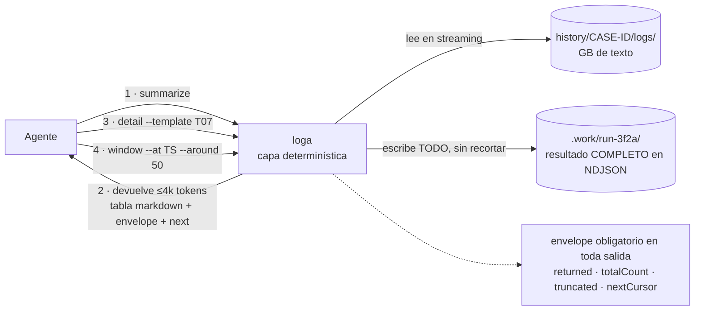

# Arquitectura y decisiones — `logharness`

> Documento 2 de 5 · v0.1 · 2026-09-11
> Cada sección presenta **alternativas → trade-offs → recomendación**.

---

## 1. Vista general



> **Cómo leer el diagrama.** Hay dos afirmaciones acá y todo lo demás las sostiene.
> **(1)** Entre el agente y los logs siempre está `loga`: no es una recomendación de estilo, es una
> regla de permisos (`deny Read`). El agente **no puede** leer un log entero aunque quiera.
> **(2)** Las dos cajas cilíndricas son las que definen qué se comparte: los logs y el trabajo en
> curso quedan en la máquina de cada persona; sólo el patrón destilado cruza a `knowledge/`, y
> cruza por un PR que alguien revisa. La flecha punteada de vuelta es el bucle de aprendizaje.

**Las dos ideas que sostienen todo:**

1. **La lógica determinística está en scripts; la interpretación está en el agente.** Todo lo que
   se puede calcular sin LLM, se calcula sin LLM. Eso hace la capa de evidencia reproducible
   (RNF-7) y barata, y confina la alucinación a la capa de interpretación, donde se la puede
   auditar con citas.
2. **`history/` es privado y desechable; `knowledge/` es público y permanente.** La promoción de
   uno al otro es explícita, curada y pasa por un PR. Es lo que resuelve la tensión entre *"todo
   lo generado va gitignorado"* y *"quiero compartirlo entre QA, Ops y Dev"*.

---

## 2. Estructura del repositorio

```
logharness/
├── README.md                        # 10 líneas: qué es, cómo empezar
├── CLAUDE.md                        # @AGENTS.md + específico de Claude Code
├── AGENTS.md                        # ← FUENTE ÚNICA del protocolo (arranca con §0 Language)
├── .gitignore                       # history/** ignorado por defecto
├── .pre-commit-config.yaml          # gitleaks
│
├── docs/                            # este pre-planning
│   ├── README.md
│   ├── 00-DISCOVERY.md
│   ├── 01-PRD.md
│   ├── 02-ARCHITECTURE.md
│   ├── 03-SKILLS-AGENTS-SCRIPTS.md
│   ├── 04-RISKS-AND-BACKLOG.md
│   └── 05-SOURCES.md
│
├── .claude/
│   ├── settings.json                # permisos (pre-aprueba loga.py), env
│   ├── skills/                      # skills FINAS que apuntan a harness/
│   │   ├── case/SKILL.md            #   orquestador conversacional
│   │   ├── interview/SKILL.md       #   grill-me
│   │   ├── triage/SKILL.md          #   preanálisis + selección de playbook
│   │   ├── hypothesize/SKILL.md
│   │   ├── read-output/SKILL.md
│   │   ├── report/SKILL.md
│   │   └── promote/SKILL.md
│   └── agents/
│       ├── log-scout.md             # explorador read-only, contexto aislado
│       └── challenger.md            # verificador adversarial
│
├── harness/                         # ← TODO EL HARNESS, CONTENIDO
│   ├── docs/
│   │   ├── method.md                # el procedimiento de investigación
│   │   ├── reading-logs.md          # cómo se leen ESTOS logs
│   │   ├── modules.md               # taxonomía: componentes, flows, prefijos
│   │   ├── known-noise.md           # lo que parece error y no lo es
│   │   ├── units-of-analysis.md     # qué contar y qué no
│   │   ├── output-contract.md       # formato que devuelven los scripts
│   │   ├── language.md              # política de idioma (ADR-011)
│   │   └── naming.md                # convención de nombres del repo (ADR-012)
│   ├── playbooks/
│   │   └── menuboard-fetch.md       # procedimiento ejecutable del patrón
│   ├── scripts/
│   │   ├── loga.py                  # CLI único (PEP 723, deps inline)
│   │   ├── loga/                    #   módulos: io, ts, drain, absence, cite...
│   │   └── cookbook.md              # recetas rg/awk/PowerShell para humanos
│   ├── templates/
│   │   ├── case.yaml.tmpl
│   │   ├── report.md.tmpl           # claves en inglés, etiquetas desde i18n/
│   │   ├── postmortem.md.tmpl
│   │   └── tldr.md.tmpl
│   └── i18n/
│       ├── es.yml                   # etiquetas de salida en español (default)
│       └── en.yml                   # etiquetas de salida en inglés
│
├── knowledge/                       # ← COMMITEADO. Lo que se comparte.
│   ├── index.yml                    # reglas de detección → patrón
│   ├── patterns/
│   │   └── menuboard-fetch-lock.md
│   └── glossary.md
│
└── history/                         # ← GITIGNORADO COMPLETO
    ├── .gitkeep
    ├── JIRA-4821/
    │   ├── case.yaml                # metadata mínima no derivable (incl. language)
    │   ├── TLDR.md                  # ≤40 líneas · lo único que se lee SIEMPRE
    │   ├── logs/                    # crudos, agrupados libremente
    │   │   ├── manifest.json        # generado por loga ingest
    │   │   ├── store-A/
    │   │   └── store-B-healthy/     # grupo baseline
    │   ├── attempts.ndjson          # APPEND-ONLY · hipótesis y veredictos
    │   ├── timeline.md              # opcional
    │   ├── analysis.md              # opcional
    │   ├── findings.md              # candidato a promoción
    │   └── .work/                   # salidas completas de los scripts
    └── archive/
        └── 2026-08-14-JIRA-4102/
```

---

## 3. Modelo de caso

### 3.1 `case.yaml` — sólo lo que NO se puede derivar

```yaml
id: JIRA-4821
slug: stale-prices-store-a          # slug SIEMPRE en inglés, kebab-case
created: 2026-09-11
language: es                        # idioma de la prosa de este caso (ver ADR-011)
goal: Entender por qué la pantalla 3 de Tienda A muestra precios de hace 9 días
severity: P2
components: [menuboard, player, localStorage]
groups:
  store-A:       { role: target,   devices: [DEX-0041] }
  store-B-healthy:  { role: baseline, devices: [DEX-0088] }
reported_by: vale
# Sellado: NO se le muestra al agente en el turno de generación de hipótesis
sealed_human_hypothesis: "creo que es el mismo bug del time offset"
related_cases: [JIRA-4102]
resolution: null          # se completa al cerrar → habilita evaluación
promoted_patterns: []
```

**Por qué YAML aparte y no frontmatter en un `.md`**: permite indexar y calcular estado sobre
todos los casos sin abrir un solo markdown, y deja el markdown limpio para lectura humana.
(Patrón tomado de `.openspec.yaml`.)

### 3.2 Estado **derivado**, nunca declarado

Este es el aprendizaje más importante de la investigación (BMAD falla justamente acá: status
manual que se desincroniza, e issue #1930 donde el agente reescribe historias ya completadas).

| Estado | Condición derivada |
|---|---|
| `empty` | Existe `case.yaml`, no hay nada en `logs/` |
| `ingested` | Existe `logs/manifest.json` |
| `interviewed` | `case.yaml` tiene `goal` + al menos una respuesta del interrogatorio |
| `triaged` | Existe al menos un run en `.work/` con `triage` |
| `investigating` | `attempts.ndjson` tiene ≥1 hipótesis con `status: open` |
| `converging` | Hay ≥1 hipótesis `supported` y ninguna `open` |
| `reported` | Existe `TLDR.md` con veredicto y las citas pasan verificación |
| `closed` | `case.yaml.resolution != null` |

`loga status --json` devuelve el estado más **la siguiente acción sugerida**. El agente lo llama
al retomar, antes de leer nada más: **~300 tokens para saber exactamente dónde está parado.**



> **Cómo leer el diagrama.** La tabla de arriba es la regla normativa —qué condición produce qué
> estado—; el diagrama muestra el **recorrido**, que es lo que la tabla no puede mostrar: los dos
> ciclos. El de `investigating` consigo mismo (se acumulan hipótesis sin borrar las anteriores) y
> el de vuelta desde `converging` cuando el `challenger` encuentra un agujero. Un caso que nunca
> retrocede de `converging` a `investigating` es sospechoso: quiere decir que nadie intentó
> refutarlo en serio.

### 3.3 `attempts.ndjson` — append-only, una línea por intento

```json
{"ts":"2026-09-11T14:03:00Z","id":"H1","status":"refuted","statement":"El bucket de localStorage quedó lleno","predicts_true":["QUOTA_EXCEEDED antes del primer fetch fallido"],"predicts_false":["existe un fetch OK posterior a un QUOTA_EXCEEDED sin cleanup"],"evidence_for":[],"evidence_against":[{"file":"store-A/DexPlayer-20260824.log","line":8821,"excerpt":"quota usage 3.2MB / 10MB"}],"why":"la quota nunca superó 3.2 MB","author":"claude-opus-5","run":"3f2a"}
{"ts":"2026-09-11T14:40:00Z","id":"H2","status":"supported","statement":"TIME_OFFSET_CHANGED invalidó LAST_FETCH_TIME","predicts_true":["el quiebre de fetches coincide con el evento de offset"],"predicts_false":["hay buckets que siguieron fetcheando después del offset"],"evidence_for":[{"file":"store-A/DexPlayer-20260824.log","line":10233,"excerpt":"TIME_OFFSET_CHANGED old=... new=..."}],"evidence_against":[],"why":"3 de 3 buckets vivos mueren en el mismo minuto","supersedes":null,"author":"claude-opus-5","run":"3f2b"}
```

**Reglas**: nunca se edita ni se borra una línea. Corregir = agregar una nueva con `supersedes`.
`predicts_false` vacío ⇒ la hipótesis **no es falsable** y el script la rechaza al escribirla.
Evidencia siempre `file` + `line` + excerpt ≤200 chars, **nunca** el bloque completo.

**Por qué NDJSON y no markdown**: es append-only por construcción, no se corrompe al truncarse,
no genera merge conflicts, se consulta con `rg` o DuckDB, y —lo decisivo— **el agente no puede
reescribir el histórico aunque quiera**. Es la mitigación estructural del anti-patrón de BMAD.
El costo (menos legible a mano) se paga con `loga attempts --format md`.

### 3.4 Camino rápido (obligatorio)

Un caso trivial se cierra con **`case.yaml` + `TLDR.md`**. Nada más. Todo el resto de artefactos
es opcional y se crea sólo cuando el caso lo amerita. Esto existe explícitamente para no caer en
la crítica documentada a Spec Kit (*"un bugfix generó 4 user stories con 16 criterios"*), que es
la causa #1 de abandono de este tipo de sistemas.

---

## 4. Decisiones de arquitectura (ADRs)

### ADR-001 — Runtime de los scripts: **Python 3.11+ con `uv` y PEP 723**

| Alternativa | Pros | Contras | Veredicto |
|---|---|---|---|
| bash + PowerShell duplicados | Cero deps, idiomático en cada plataforma | **Doble mantenimiento y divergencia garantizada**. PS 5.1 vs 7 bifurca de nuevo. Los defaults de encoding difieren y están mal documentados (issue abierto hace años) | ❌ |
| **Python + uv (PEP 723)** | Un archivo, deps declaradas inline, `uv run` idéntico en los 3 SO, sin venv ni requirements. **Todo el ecosistema de log mining (drain3, logparser) es Python.** Legible por QA | Requiere instalar `uv` (un comando: `winget install astral-sh.uv`) | ✅ |
| Node | Ubicuo en equipos web | Ecosistema de log mining pobre, manejo de encodings menos completo, `node_modules` | ⚠️ sólo si el equipo fuera 100% JS |
| Go compilado | Binario único, arranque instantáneo, rapidísimo | **QA y Ops no pueden leer ni parchear el script.** Pipeline de build y distribución de binarios | ⚠️ opcional para el hot path de multi-GB |

**Decisión**: Python + uv. Ejemplo de la cabecera:

```python
#!/usr/bin/env -S uv run --script
# /// script
# requires-python = ">=3.11"
# dependencies = ["drain3>=0.9.11", "pyyaml", "orjson"]
# ///
```

**Regla complementaria**: Python es la lógica; `ripgrep`, `duckdb`, `zstd` son **aceleradores
opcionales** detectados con `shutil.which()`, con fallback puro-Python. *El harness nunca debe
"no andar" en la laptop de un tester.* (RNF-2)

Nota de migración: los comandos `awk`/`grep` verificados de la skill actual se conservan en
`harness/scripts/cookbook.md` para uso interactivo humano en Linux/Mac, pero la lógica canónica
se porta a `loga`.

---

### ADR-002 — Persistencia por caso: **híbrido con camino rápido**

| Alternativa | Pros | Contras |
|---|---|---|
| A · Un solo `.md` por caso (estilo story file de BMAD) | Fricción mínima, un diff legible, fácil de grepear | No escala: archivos de 2.000 líneas queman contexto en cada retoma. No hay TL;DR separable. El "append-only" queda como convención sin enforcement |
| B · Árbol completo estilo OpenSpec (proposal/design/tasks/specs) | Máxima fidelidad al modelo de referencia | 7 archivos por caso es ceremonia excesiva para un incidente de 20 min. El delta→knowledge es trabajo manual real |
| **C · Híbrido** (`case.yaml` + `TLDR.md` + `attempts.ndjson` + opcionales) | Estado derivable; histórico inmutable sin merge conflicts; TL;DR separado del detalle; escala | Tres formatos (yaml/ndjson/md) es más superficie. NDJSON necesita un renderer |

**Decisión: C**, con **Fase 1 = sólo `case.yaml` + `TLDR.md` + `logs/` + `attempts.ndjson`.**
`timeline.md`, `analysis.md` y `findings.md` se agregan en Fase 2 con criterios explícitos de
cuándo crearlos (igual que el `design.md` opcional de OpenSpec).

---

### ADR-003 — Dónde vive el harness: **`harness/` como fuente, `.claude/` fino**

Tensión real: pediste que el harness esté *contenido en una carpeta*, pero Claude Code sólo
descubre skills y agentes en `.claude/` en la raíz.

| Alternativa | Pros | Contras |
|---|---|---|
| A · Todo dentro de `.claude/` | Nativo, cero indirección | Rompe la contención pedida y no sirve a otros agentes |
| B · `harness/` + symlinks a `.claude/` | Fuente única real | **Los symlinks requieren Admin o Dev Mode en Windows.** Descartado por C1 |
| C · `harness/` + script de sync que copia a `.claude/` | Fuente única, cross-platform | **Drift**: alguien edita la copia y se pierde. Un paso más que olvidar |
| **D · `harness/` fuente + skills finas que apuntan ahí** | Sin duplicación, sin sync, sin symlinks. `.claude/` queda como *registro*, no como contenido | Un nivel de indirección al leer una skill |

**Decisión: D.** Cada `SKILL.md` tiene 30-60 líneas: cuándo dispara, qué hacer, y referencias a
`harness/docs/*.md` y `harness/playbooks/*.md`. El conocimiento pesado vive una sola vez en
`harness/` y lo leen igual Claude, Codex o Cursor.

```markdown
---
name: triage
description: >
  Preanaliza un caso de logs y elige qué playbook y qué comandos correr.
  TRIGGER cuando el usuario pide analizar un caso, pasa logs o menciona un ID de Jira.
---
# Triage de caso

1. Corré `uv run harness/scripts/loga.py status --json` para saber dónde está el caso.
2. Leé `harness/docs/method.md` §2 (preanálisis).
3. Matcheá contra `knowledge/index.yml` ANTES de investigar.
4. Si matchea un patrón → seguí `harness/playbooks/<slug>.md`.
   Si no → invocá la skill `hypothesize`.

REGLAS DURAS: ver `harness/docs/reading-logs.md` §Reglas.
```

⚠️ **Verificar contra la documentación vigente** los campos exactos de frontmatter de skills y
subagentes antes de escribirlos (el conjunto de campos soportados cambia entre versiones de
Claude Code). El diseño no depende de campos exóticos: `name` + `description` alcanzan.

---

### ADR-004 — El orquestador: **skill conversacional + CLI de estado**

"Orquestador" puede significar tres cosas distintas. Las tres son válidas, para etapas distintas:

| Alternativa | Qué es | Cuándo |
|---|---|---|
| A · **Skill `/case` + protocolo en `AGENTS.md`** | El orquestador es un documento que el agente sigue. Cero código | ✅ Fase 1 |
| B · **CLI `loga` que posee el estado** | El agente consulta `loga status --json` y obtiene estado + siguiente acción. La máquina de estados vive en código, no en el prompt | ✅ Fase 1, complementario |
| C · Programa con Agent SDK que llama a Claude programáticamente | Análisis batch de flota sin humano en el loop, en CI | Fase 3 |

**Decisión: A + B.** Es exactamente el contrato agente↔CLI de OpenSpec: el CLI es la autoridad
sobre el estado y devuelve **un** documento JSON por invocación (prosa a stderr); el agente aporta
la conducción conversacional. Ventaja concreta: el estado no depende de que el modelo se acuerde,
y la misma máquina de estados sirve a Claude, a Codex y a un script de CI.

El flujo que orquesta la skill `/case`:



> **Cómo leer el diagrama.** Los rombos no son pasos: son **preguntas que se le hacen a
> `loga status`, no al modelo**. Por eso las tres flechas de vuelta a `status` — después de cada
> acción el orquestador vuelve a preguntar dónde está, en vez de acordarse. Y hay dos puertas de
> las que no se sale sin pasar: el `challenger` antes de aceptar una hipótesis, y
> `verify-citations` antes de emitir cualquier informe. Todo lo demás es ruteo.

---

### ADR-005 — Qué se commitea: **`knowledge/` sí, `history/` no, promoción curada**

Tu requerimiento fue *"ignorar todo lo generado por análisis y persistencia"*. Tomado al pie de la
letra, nada se comparte y el sistema no acumula nada — que es justo lo contrario de lo que querés
lograr con QA/Ops/Dev.

**Resolución en dos niveles:**

| Nivel | Contenido | Git | Por qué |
|---|---|---|---|
| `history/` | Logs crudos, análisis en curso, `.work/`, attempts | **Ignorado completo** | Contiene datos de cliente, es ruidoso, es trabajo personal en progreso |
| `knowledge/` | Patrones confirmados, playbooks, índice de detección, glosario | **Commiteado** | Es conocimiento destilado, sin datos de cliente, revisado en PR |

La **promoción** (`loga promote <caso>`) genera un borrador de patrón desde `findings.md`,
lo sanitiza (sin IDs de tienda, sin IPs) y lo deja listo para PR. Eso convierte la revisión de
conocimiento en code review, que es el ritual que Desarrollo ya tiene.

`.gitignore` recomendado — **denylist agresiva con allowlist explícita**:

```gitignore
history/**
!history/.gitkeep
*.log
*.log.*
*.ndjson
.work/
**/manifest.json
*.zip
*.7z
*.gz
*.zst
```

⚠️ `.gitignore` no protege archivos **ya trackeados**. Por eso RF-8.2 (pre-commit con gitleaks)
y RF-8.3 (CI sobre historia completa) no son opcionales: el hook local se saltea con `--no-verify`.

**Opción alternativa considerada**: `history/` en un repo privado separado o fuera del repo
(la mitigación más fuerte contra commits accidentales). Recomendación: dejar `history/` dentro
por comodidad, pero soportar `LOGA_HISTORY_DIR` para que quien maneje datos sensibles lo apunte
afuera del repo.

---

### ADR-006 — Motor de resumen: **Drain3 con masking de dominio**

| Alternativa | Pros | Contras |
|---|---|---|
| grep artesanal por patrón conocido | Cero deps, exacto | No descubre nada nuevo; no escala a patrones desconocidos |
| **Drain3** | Reducción medida de 10³–10⁶:1. Mejor grouping accuracy del benchmark y de los pocos que terminan a escala. Streaming, snapshot persistible para logs rotados. **Su masking hace parte de la redacción de PII gratis** | Accuracy cae con escala (FGA 0.75→0.55 en loghub-2.0); flojo con templates de 5+ parámetros |
| Embeddings + clustering semántico | Captura similitud semántica | Caro, no determinístico, requiere GPU o API. **No va en un harness de QA** |
| Parsers con LLM (DivLog) | Mejor accuracy a nivel token | Costo y latencia prohibitivos para millones de líneas |

**Decisión: Drain3**, con masking agresivo **configurado para estos logs** (timestamps, GUIDs,
IPs, paths, números, IDs de tienda, hashes). El masking es lo que más mueve la aguja en precisión.
Snapshot de estado persistido en `.work/` para analizar logs rotados incrementalmente.

**Complemento**: clustering semántico dentro del bucket de errores sólo si los templates de Drain
resultan demasiado granulares (Fase 3, nice-to-have).

**Anti-recomendaciones respaldadas por evidencia**: no usar compresión estructural tipo LogZip
(GPTScore 0.41 — peor que borrar líneas al azar). No mandar el log crudo "porque el modelo tiene
200k de contexto" (0.353 vs 0.670).

---

### ADR-007 — Detección por **ausencia** como primitiva de primera clase

No hay ADR alternativo acá: es un hueco del estado del arte que tu propio caso de referencia expone.

Drain3, Grafana Sift, Sentry y todo el prior art detectan **lo que está** en el log. El caso
`menuboard-fetch-lock` se diagnostica exclusivamente por **lo que no está**: un bucket con
montajes > 0 y fetches = 0. Como el código no loguea la rama negativa, *la firma del error es una
ausencia*.

`loga absence` formaliza esto:

```bash
loga absence \
  --scope     "TPL Mode: STORE"                 # qué define una unidad de observación
  --key       "SKUs found in configs:(\d+)|Local Storage found: (\d+)"   # cómo agrupar
  --expect    "Fetch started"                   # qué debería aparecer
  --per       day                               # cada cuánto
```
→ tabla `grupo | periodo | ocurrencias_scope | ocurrencias_expect | veredicto`

Esto generaliza el paso 2 de la skill actual (el "test central") y sirve para cualquier patrón
del tipo *"esto debería pasar cada X y no está pasando"* — que en logs de players es
extremadamente común (heartbeats, syncs, descargas de media, reportes de estado).

**Es la pieza más diferencial del harness y debe estar en el MVP.**

---

### ADR-008 — Contrato de salida de los scripts

Tres niveles, siempre en ese orden (validado por LogDx-CI: en modo agente con tool-use, lo
decisivo no es el método exacto de reducción sino que el agente **pueda pedir más y sepa que hay
más**):

| Nivel | Comando | Presupuesto | Qué devuelve |
|---|---|---:|---|
| 1 | `summarize` | ≤4k tokens | Panorama: templates, conteos, rango temporal |
| 2 | `detail` | ≤6k tokens | Líneas literales de un template |
| 3 | `window` / `trace` | ≤8k tokens | Ventana cruda multi-archivo |



> **Cómo leer el diagrama.** Lo importante no son los tres niveles sino **la asimetría**: el
> resultado completo siempre se escribe a disco y lo que vuelve al agente es un resumen con un
> puntero. Nada se pierde y nada desborda. Las flechas 3 y 4 son el bucle de profundización: el
> benchmark dice que cuando el agente puede pedir más, la calidad del resumen inicial importa 7×
> menos —siempre que el `envelope` le avise que hay más. Un resumen truncado sin avisar es peor
> que no tener resumen.

**Formato**: NDJSON en disco (streameable, apendeable, truncable sin corromperse, consultable con
`rg`/DuckDB) · **tabla markdown al contexto del agente** (ahorra 34-38% de tokens vs JSON y es
legible para humanos) · JSON compacto sólo para el envelope de metadatos.

Descartado: TOON (ahorra 40% pero nadie del equipo puede leerlo ni depurarlo) y XML (+80% de
tokens y la peor accuracy medida).

**Envelope anti-truncación silenciosa** — obligatorio, es el bug más peligroso del patrón:

```json
{"items":[...], "returned":20, "totalCount":3187, "truncated":true,
 "nextCursor":"...", "artifact":".work/run-3f2a/detail.ndjson",
 "next":["loga detail --template T07 --cursor ...","loga window --at 2026-08-24T03:12Z"]}
```

> Un agente que recibe 20 de 3.187 errores **sin saberlo** concluirá con confianza algo falso.

---

### ADR-009 — Wrapper multi-agente

Claude Code **no lee `AGENTS.md`** nativamente. Opciones: symlink (falla en Windows sin Dev Mode),
duplicar (drift garantizado) o importar.

**Decisión**: `AGENTS.md` es la fuente única y `CLAUDE.md` la importa:

```markdown
<!-- CLAUDE.md -->
@AGENTS.md

## Específico de Claude Code
- Respetá siempre `AGENTS.md` §0 (Language) antes de escribir la primera respuesta.
- Usá el subagente `log-scout` para cualquier barrido sobre más de 3 archivos:
  aísla el contexto y devuelve sólo el resumen.
- Antes de emitir un veredicto, invocá el subagente `challenger`.
- Los comandos de `loga` ya están pre-aprobados en `.claude/settings.json`; no pidas permiso.
```

El núcleo del protocolo en `AGENTS.md` no debe depender de features exclusivas de Claude Code, de
modo que Codex o Cursor puedan seguirlo con degradación elegante (sin subagentes, pero con el
mismo método y los mismos scripts).

---

### ADR-010 — Permisos y gestión de contexto en Claude Code

```jsonc
// .claude/settings.json  (compartido por git)
{
  "permissions": {
    "allow": [
      "Bash(uv run harness/scripts/loga.py:*)",
      "Read(./knowledge/**)",
      "Read(./harness/**)",
      "Write(./history/**)"
    ],
    "deny": [
      "Read(./history/**/logs/**)"   // ← fuerza el uso de loga en vez de Read directo
    ]
  },
  "env": { "LOGA_HISTORY_DIR": "./history" }
}
```

La regla `deny` sobre `history/**/logs/**` es la implementación mecánica de la regla que la skill
actual pide en prosa (*"Nunca leas un log completo con Read"*). **Mucho más confiable que pedírselo
al modelo.**

Opcional (Fase 2): un hook `PreToolUse` que bloquee lecturas de archivos por encima de N líneas y
sugiera el comando de `loga` equivalente. Y un hook `SessionStart` que inyecte el `loga status`
del caso activo.

⚠️ Verificar la sintaxis exacta de permisos y hooks contra la documentación vigente al implementar.

---

### ADR-011 — Política de idioma: **identificadores en inglés, prosa en el idioma del usuario**

Dos idiomas conviven en el repo y la regla que los separa tiene que ser mecánica, no de criterio.

| Capa | Idioma | Por qué |
|---|---|---|
| **Identificadores**: carpetas, archivos, comandos, subcomandos, flags, claves YAML/JSON, estados, slugs de patrón, IDs de hipótesis, nombres de skills y subagentes | **Inglés, siempre** | Son contrato de máquina. Un `sed`, un `grep` o un import no deben depender de acentos ni de traducción. Además es lo que hace el repo legible para cualquier agente y para cualquier herramienta externa |
| **Prosa**: documentación, comentarios, descripciones de patrones, informes generados, preguntas al usuario | **Idioma del usuario, por defecto español** | QA y Operaciones son los usuarios principales y los informes terminan en Jira en español |
| **Excerpts de log** | **Verbatim, jamás traducidos** | Son evidencia. Traducir una cita la invalida |

#### Detección de idioma (§0 de `AGENTS.md`)

El protocolo arranca con este bloque, antes que cualquier otra instrucción:

```markdown
## §0 · Language

Antes de responder, resolvé el idioma de la prosa en este orden y pará en el primero que aplique:

1. Si hay un caso activo y `case.yaml` tiene `language`, usá ese. Fin.
2. Si el usuario pidió explícitamente un idioma en esta conversación, usá ese y escribilo
   en `case.yaml.language`.
3. Inferí el idioma del primer mensaje con contenido del usuario. Si es claro, usalo y
   escribilo en `case.yaml.language`.
4. Si es ambiguo —el mensaje es sólo un ID de ticket, una ruta, un comando, o la skill se
   invocó sin texto (`/case JIRA-4821`)— **preguntá una vez, en español e inglés, en una
   sola línea**, y guardá la respuesta:
   > ¿Seguimos en español o preferís inglés? / Spanish or English?
5. Sin ninguna señal: **español**.

Esto afecta ÚNICAMENTE la prosa. Nunca cambia nombres de archivos, comandos, flags,
claves, estados, slugs ni IDs, que son siempre en inglés. Los excerpts de log se citan
textuales, sin traducir.
```

#### Implementación de las etiquetas de salida

Las plantillas llevan **claves en inglés** y las etiquetas salen de `harness/i18n/<lang>.yml`.
Así se agrega un idioma sin duplicar plantillas ni tocar los scripts.

```yaml
# harness/i18n/es.yml
tldr:
  verdict:    VEREDICTO
  cause:      CAUSA
  evidence:   EVIDENCIA
  ruled_out:  DESCARTADO
  action:     ACCIÓN
  preventive: PREVENTIVA
  limits:     LÍMITES
confidence: { high: alta, medium: media, low: baja }
```

**Alternativas consideradas**: plantillas duplicadas por idioma (se desincronizan, es el problema
clásico); todo en inglés incluido el informe (fricción real para QA/Ops y para pegar en Jira);
todo en español incluidos los identificadores (rompe el grep y la interoperabilidad).
La tabla de i18n cuesta ~20 líneas y resuelve las tres.

**Alcance en Fase 1**: sólo `es.yml`. `en.yml` se agrega cuando aparezca el primer usuario que lo
necesite; la estructura ya lo soporta.

---

### ADR-012 — Convención de nombres

Reglas mecánicas, documentadas en `harness/docs/naming.md` y verificables por `loga lint-repo`:

| Elemento | Convención | Ejemplo |
|---|---|---|
| Carpetas y archivos del repo | `kebab-case`, inglés | `harness/docs/units-of-analysis.md` |
| Documentos de planning | `NN-SCREAMING-KEBAB.md` | `04-RISKS-AND-BACKLOG.md` |
| Skills y subagentes | `kebab-case`, **verbo o rol en inglés** | `read-output`, `challenger` |
| Subcomandos del CLI | `kebab-case`, verbo | `verify-citations`, `first-error` |
| Flags | `--kebab-case` | `--baseline`, `--around` |
| Claves YAML / JSON / NDJSON | `snake_case`, inglés | `predicts_false`, `ts_utc` |
| Estados del caso | `lowercase`, inglés | `investigating`, `converging` |
| Slugs de patrón | `kebab-case`, inglés | `menuboard-fetch-lock` |
| Constantes de patrón (display) | `SCREAMING-KEBAB` | `MENUBOARD-FETCH-LOCK` |
| IDs de caso | el del tracker, tal cual | `JIRA-4821` |
| IDs de hipótesis | `H<n>` | `H1`, `H2` |
| Grupos de logs | `kebab-case`, inglés, con rol explícito | `store-a`, `store-b-healthy` |
| Variables de entorno | `SCREAMING_SNAKE` con prefijo | `LOGA_HISTORY_DIR` |

**Excepción deliberada**: `knowledge/index.yml` lleva la clave `symptoms.es` con las frases que
QA y Operaciones usan realmente al reportar ("no actualiza precios", "muestra precios viejos").
Son **datos de matcheo en el idioma del reporte**, no identificadores, y traducirlas al inglés
rompería el triage. La clave (`symptoms`) es inglés; el contenido es del idioma que corresponda.

Lo mismo aplica a la `description` de cada skill: el frontmatter está en inglés, pero los
**triggers incluyen las frases en español** con las que el usuario va a pedir las cosas. Si no,
la skill no dispara nunca.
