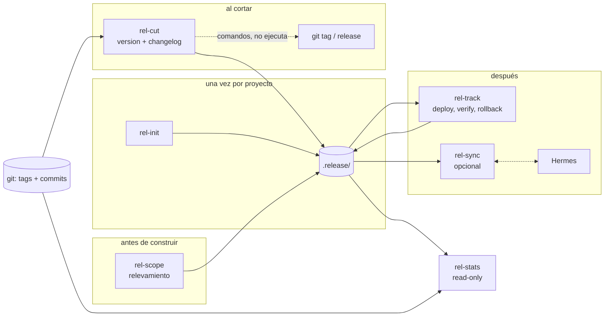
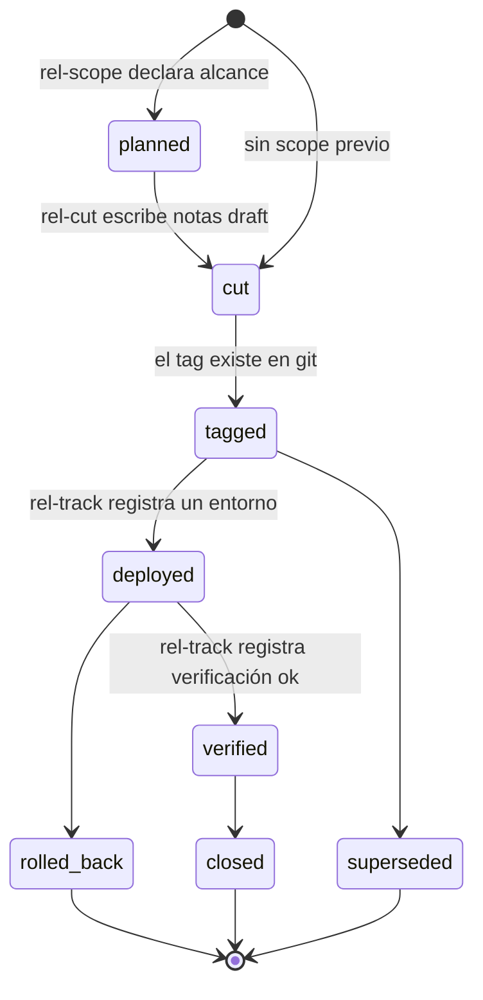

# release-tracker — Plan de diseño

Plan para un paquete de skills que cubra **preparación de releases, seguimiento posterior,
relevamiento y estadísticas por tag**, usable en varios proyectos de una VPS y opcionalmente
conectado a Hermes.

Estado: **propuesta**. Nada construido todavía. Este documento es el contrato antes de escribir la
primera skill.

## Tabla de contenidos

- [1. Resumen y recomendación](#1-resumen-y-recomendación)
- [2. Qué se pidió, descompuesto](#2-qué-se-pidió-descompuesto)
- [3. La decisión de arquitectura](#3-la-decisión-de-arquitectura)
- [4. Dónde vive la verdad](#4-dónde-vive-la-verdad)
- [5. Workspace y modelo de datos](#5-workspace-y-modelo-de-datos)
- [6. Las skills, una por una](#6-las-skills-una-por-una)
- [7. Contratos compartidos](#7-contratos-compartidos)
- [8. Correlación commits ↔ tareas ↔ docs](#8-correlación-commits--tareas--docs)
- [9. Métricas honestas](#9-métricas-honestas)
- [10. Multi-proyecto y VPS](#10-multi-proyecto-y-vps)
- [11. Integración con Hermes](#11-integración-con-hermes)
- [12. Fronteras con las skills que ya existen](#12-fronteras-con-las-skills-que-ya-existen)
- [13. Plan de construcción por fases](#13-plan-de-construcción-por-fases)
- [14. Decisiones abiertas](#14-decisiones-abiertas)
- [15. Riesgos y modos de falla](#15-riesgos-y-modos-de-falla)
- [16. Checklist de field-test](#16-checklist-de-field-test)

---

## 1. Resumen y recomendación

**Varias skills, sin orquestador, con workspace persistido.** Un paquete `release-tracker` con
5 skills núcleo (`rel-init`, `rel-scope`, `rel-cut`, `rel-track`, `rel-stats`), 1 opcional
(`rel-sync`, el adaptador Hermes) y 3 contratos compartidos chicos.

Las tres partes de esa recomendación, y por qué:

| Decisión | Razón corta |
|---|---|
| **Varias skills, no una** | las cuatro capacidades tienen límites de escritura distintos: cortar una release toca tags de git, leer estadísticas no toca nada. Una sola skill diluye los guardrails y pasa las ~150 líneas que el repo se impone por `SKILL.md` |
| **Sin orquestador tipo SDD** | el orquestador existe para *rutear* pedidos ambiguos entre muchos flujos y administrar presupuesto de contexto entre workers. Acá la intención casi siempre es explícita ("cortá la release", "cómo viene el proyecto X") y el ruteo por trigger alcanza. `BP-ORCHESTRATOR.md` son ~240 líneas que se cargarían en cada pregunta trivial |
| **Con workspace persistido** | "seguimiento" es exactamente la parte que tiene que sobrevivir a la sesión. Sin ledger en disco no hay historia, y sin historia no hay estadísticas. Esto es lo que separa este paquete de `doc-writer` |

**No agentes.** Los agentes de este repo (`agents/agents-generic/*.agent.md`) son *personas* para
trabajo interactivo de desarrollo, no unidades de workflow. Este trabajo es procedural. El único lugar
donde un subagente se paga solo es leer un rango grande de commits con una pregunta acotada — y eso es
una delegación *dentro* de una skill, no una definición de agente nueva.

### Un tercer nivel en el repo

Hoy el repo tiene dos niveles y este paquete cae limpio en el medio:

| Nivel | Ejemplo | Estado | Coordinación |
|---|---|---|---|
| Skill suelta | `doc-writer`, `commit-closer` | ninguno, muere con la sesión | ninguna |
| **Harness liviano** | **`release-tracker`** | **workspace en disco** | **el workspace mismo** |
| Harness completo | `sdd-lite`, `blueprint-harness` | workspace + `state.yaml` + lifecycle | orquestador + envelopes |

La coordinación por workspace en vez de por orquestador es el punto clave: cada skill lee el estado del
disco, hace lo suyo, y escribe. No hay envelope, no hay routing table, no hay `state_mutations`. El
`index.yaml` es el punto de encuentro.

### Cuándo revisar esta decisión

Agregar un orquestador recién cuando se cumpla alguna de estas — no antes:

- aparece un cuarto flujo y el usuario tiene que decir explícitamente qué skill quiere porque los
  triggers empiezan a pisarse
- una operación necesita encadenar 3+ skills con checkpoints intermedios
- el paquete arranca a leer 4+ archivos del repo solo para decidir qué hacer

---

## 2. Qué se pidió, descompuesto

El pedido son cuatro capacidades distintas más dos ejes transversales:

| # | Capacidad | Naturaleza | Escribe |
|---|---|---|---|
| 1 | Hacer releases | lee git (tags, commits), produce changelog y notas | sí, artefacto + opcionalmente tag |
| 2 | Seguimiento de releases | lee el ledger, registra qué pasó después | sí, transiciones de estado |
| 3 | Relevamiento por chat | entrevista, produce documento de alcance | sí, documento |
| 4 | Estadísticas / changelog por tag | lee git + ledger | no (o reporte efímero) |
| A | Vínculo con commits de un proyecto | transversal | — |
| B | Vínculo con tareas y docs | transversal | — |

Los dos ejes transversales son lo que hace que esto sea un paquete y no cuatro skills sueltas: las
cuatro capacidades comparten el mismo modelo de "qué es una release y qué la compone".

Hay además una asimetría importante que conviene nombrar temprano: **la capacidad 3 es la que crea el
denominador de la capacidad 4.** Sin un documento de alcance que diga qué se pretendía entregar, no
existe "porcentaje de avance" — solo existe throughput. Eso condiciona el diseño de las métricas
(sección 9).

---

## 3. La decisión de arquitectura

### El criterio

El repo ya usa un criterio implícito para decidir entre skill suelta y harness, y conviene hacerlo
explícito: **¿el trabajo tiene un ciclo de vida que debe sobrevivir a la sesión y ser retomable desde
disco?**

- `doc-writer`: no. Una sesión, un documento, listo. Su propio README lo dice: *"It does not maintain
  what it writes."*
- `sdd-lite`: sí. Un change atraviesa etapas durante días.
- **release-tracker: sí, sin ambigüedad.** Una release es un objeto con estados (`planned` → `cut` →
  `tagged` → `deployed` → `verified` → `closed`), vive días o semanas, cruza proyectos, y todo el valor
  de "seguimiento" está en el registro persistido.

Pero el ciclo de vida es **mucho más simple** que el de `sdd-lite`: ~6 estados y una sola forma de
objeto, contra 11 etapas y 4 tipos de objetivo. Esa diferencia de tamaño es lo que descarta el
orquestador.

### Por qué no una skill única

| Argumento | Detalle |
|---|---|
| Límites de escritura incompatibles | `rel-stats` es read-only por diseño; `rel-cut` propone comandos de git que taggean. Un solo archivo tendría que sostener "nunca escribas" y "así se taggea" a la vez, y el guardrail se diluye |
| Presupuesto | el repo se impone `SKILL.md` bajo ~150 líneas (`bp-persistence-contract.md`). Las cuatro capacidades juntas dan 500+ |
| Precisión de trigger | "cómo viene el proyecto" y "cortá la release" no deberían cargar el mismo contexto |
| Precedente propio | `doc-writer` deliberadamente deja el chequeo de drift a una skill hermana futura en vez de crecer |

### Por qué no un orquestador tipo SDD

El orquestador de `blueprint-harness` hace seis cosas. Acá cinco de las seis no aplican:

| Función del orquestador BP | ¿Aplica acá? |
|---|---|
| rutear entre F1/F2/F3 según ambigüedad | no — la intención es explícita, el trigger alcanza |
| correr protocolos de entrevista propios | no — la única entrevista vive completa dentro de `rel-scope` |
| elegir profundidad con rúbrica de complejidad | no — una release no tiene bandas de complejidad |
| armar envelopes y despachar workers | no — no hay workers, las skills se invocan directo |
| ser el único escritor de estado | **sí** — pero se resuelve con una tabla de ownership en el contrato de persistencia, igual que hace `bp-persistence-contract.md`, sin necesidad de un proceso que medie |
| preservar resumabilidad | **sí** — se resuelve con digests en cada artefacto, sin mediador |

Costo real de agregarlo igual: ~240 líneas cargadas antes de poder responder "¿cuántos commits van
desde el último tag?".

Lo que **sí** hace falta y reemplaza al orquestador: un bloque de ~20 líneas inyectado en
`CLAUDE.md` / `AGENTS.md` por `rel-init`, con la tabla de "qué skill para qué pedido" y la ruta del
workspace. Mismo mecanismo de wrapper que ya usa `bp-init`, una décima parte del tamaño.

### Flujo resultante



Ninguna flecha entre skills. Todas pasan por el workspace. Eso es lo que permite que cada una se invoque
sola, en cualquier orden, en cualquier sesión.

---

## 4. Dónde vive la verdad

La decisión más importante del diseño, porque determina qué se puede perder sin consecuencias.

| Fuente | Autoridad sobre | Por qué |
|---|---|---|
| **git (tags + commits)** | qué se entregó realmente | inmutable, distribuido, sobrevive a todo lo demás |
| **`.release/` en el repo** | la narrativa: alcance, decisiones, deploys, incidentes | versionable, diffeable, revisable en un PR |
| **Hermes** | nada — es una **proyección** | una base de un bot es lo más fácil de perder o rotar |

Reglas que salen de ahí:

- Hermes **nunca** es la fuente de un dato que las skills necesiten para funcionar. Si Hermes no está,
  todo el paquete anda igual.
- El ledger **nunca** contradice a git. Cuando el digest dice `tagged: v1.4.0` y el tag no existe, gana
  git y el ledger se repara — misma regla que usa `BP-ORCHESTRATOR.md` (*"digests win, repair state"*),
  invertida porque acá hay una fuente externa más dura.
- Nada de lo que se persiste se deriva de la memoria del chat.

---

## 5. Workspace y modelo de datos

### Layout

```text
.release/
  config.yaml               # identidad del proyecto, esquema de versión, entornos, política de git
  index.yaml                # índice de releases y scopes — el punto de encuentro
  scopes/
    {slug}.md               # relevamientos: qué se pretende entregar
  releases/
    {version}.md            # una por release: notas, commits, deploys, incidentes
  reports/
    {slug}.md               # salidas de rel-stats que el usuario decidió persistir
  templates/                # del usuario; sembrados una vez por rel-init, nunca pisados
```

Dentro del repo del proyecto, no en un lugar central. Razones: se commitea con el código que describe,
se revisa en el mismo PR, y se clona con el repo. El rollup multi-proyecto (sección 10) es **derivado**,
nunca una segunda copia.

### Ciclo de vida de una release



`deployed` no es escalar: una release puede estar `deployed` en `staging` y no en `production`. El
estado global de la release es el **mínimo** de sus entornos declarados en `config.yaml`.

### Digest

Mismo patrón que usa el repo hoy (`bp-persistence-contract.md`): cada artefacto abre con un bloque plano
de campos, sin prosa, que es lo único que otra skill necesita leer para decidir.

```
## Release Digest
- status: planned | cut | tagged | deployed | verified | closed | rolled_back | superseded
- version: v1.4.0
- range: v1.3.2..v1.4.0
- tagged_at: YYYY-MM-DD
- environments: staging=verified, production=pending
- scope: {slug} | none
- summary: <una línea>
```

`index.yaml` guarda una copia de una línea de cada digest. Esa es toda la indexación que hace falta.

### Presupuestos

| Artefacto | Palabras |
|---|---|
| scope (relevamiento) | 300–600 |
| release notes | 250–500 |
| reporte de stats | 200–400 |

Pasarse significa recortar antes de persistir, no preguntar.

---

## 6. Las skills, una por una

### `rel-init` — bootstrap

Detecta y confirma, no adivina: esquema de versión (semver / calver / ninguno), patrón de tag
(`v1.2.3` vs `1.2.3` vs `proyecto-v1.2.3`), rama base, si el proyecto usa Conventional Commits (lo
verifica leyendo los últimos ~50 subjects, no preguntando), ubicación del `CHANGELOG.md` si existe, y
la lista de entornos de deploy.

Escribe `config.yaml`, `index.yaml` vacío, siembra `templates/`, copia las skills a
`.claude/skills/` y `.agents/skills/`, e inyecta el bloque wrapper en `CLAUDE.md` / `AGENTS.md` con
preview y confirmación. Máximo 2 preguntas. Nunca toca `.gitignore`.

Re-ejecutarlo con la misma versión es no-op; con versión nueva ofrece update preservando `templates/`
y todo el contenido del workspace. Copiado literal del comportamiento de `bp-init`, que ya está probado.

### `rel-scope` — relevamiento

La skill conversacional. Entrevista para producir un **documento de alcance de release**: qué se
pretende entregar, qué queda explícitamente afuera, qué tareas y documentos lo respaldan, y cuáles son
las señales de aceptación.

Lo que la distingue de `doc-writer`: `doc-writer` documenta **lo que existe**, `rel-scope` declara **lo
que se pretende**. Son tiempos verbales distintos y por eso la regla de evidencia se invierte —
`doc-writer` no puede afirmar lo que ninguna fuente sostiene; `rel-scope` está registrando intención,
que por definición todavía no tiene evidencia. Lo que sí hereda es la disciplina de marcar qué es
decisión tomada y qué es supuesto sin confirmar.

Estructura de la entrevista, prestada de `questionnaire` (interrogar la **forma**, no la respuesta):

| Ronda | Qué se busca |
|---|---|
| 1 | objetivo de la release, usuarios/flujos afectados, límite in/out |
| 2 | restricciones firmes, qué se rompe si sale mal, qué evidencia declara "listo" |

Máximo 2 rondas, 3 preguntas por ronda, y se saltea lo que `config.yaml` ya responde. Cuando aparece
algo que lo sabe un tercero, no se inventa: se deriva a `questionnaire`.

Salida: `.release/scopes/{slug}.md` en estado `planned`. **Este documento es el denominador** de
cualquier métrica de avance posterior.

### `rel-cut` — preparar la release

El corazón operativo.

1. Resolver y **congelar** el rango: último tag → `HEAD`, o el rango que el usuario indique. Se
   registran los SHAs. Todo lo que sigue lee esa referencia congelada, nunca un árbol que se mueve.
2. Clasificar los commits del rango por tipo, scope y área tocada. Rango grande (>40 commits) se
   delega a un subagente con pregunta acotada, no se lee inline.
3. **Proponer el bump de versión con el razonamiento visible**: qué commit dispara `major`, cuáles
   `minor`, cuáles no mueven nada. Nunca un número sin justificación.
4. Redactar el changelog (agrupado por tipo) y las release notes (agrupadas por *concern*, no por
   archivo — misma regla que `sddl-delivery`: el diff ya lista los archivos).
5. Correlacionar contra scopes y tareas (sección 8) y reportar lo que quedó fuera del alcance
   declarado y lo declarado que no se entregó. Esa doble lista es el aporte real de la skill.
6. Escribir `.release/releases/{version}.md` en `cut`, actualizar `index.yaml`.
7. Devolver los comandos exactos de git como bloque copiable.

**Política de escritura de git.** Por defecto `rel-cut` **no ejecuta** comandos de git que escriben:
entrega `git tag -a … && git push origin …` listo para pegar. Es el estilo de la casa
(`sddl-delivery`: *"no git write commands, and no offer to run one"*; `resolving-merge-conflicts`:
*"hands back the closing command"*) y es el correcto para una operación que publica algo hacia afuera.
Se puede habilitar la ejecución con `git.allow_write: true` en `config.yaml` más confirmación explícita
por corrida — nunca las dos cosas implícitas. Ver decisión abierta D2.

### `rel-track` — seguimiento

Lo que pasa **después** del tag, que es donde vive la palabra "seguimiento".

Registra eventos contra una release existente: deploy a un entorno, resultado de verificación,
incidente, rollback, cierre. Cada evento lleva timestamp, entorno, y evidencia (un SHA, una URL de run,
o "reportado por el usuario" — declarado como tal).

Recalcula el estado global de la release desde sus entornos y actualiza el digest y el `index.yaml`.
No juzga: si el usuario dice que verificó, se registra como verificación reportada, no como
verificación probada.

Es también el punto natural de entrada para eventos que llegan desde la VPS vía `rel-sync`.

### `rel-stats` — estadísticas y changelog por tag

Read-only, sin excepción. Tres modos:

| Modo | Entrada | Salida |
|---|---|---|
| `release` | un tag o rango | changelog + composición de esa release |
| `trend` | últimas N releases | evolución entre releases |
| `rollup` | varios workspaces | estado comparado de proyectos (sección 10) |

Lo que mide y lo que se niega a medir está en la sección 9. Por defecto responde en chat; persiste en
`reports/` solo si el usuario lo pide (oferta una vez, nunca bloquea).

### `rel-sync` — adaptador Hermes (opcional)

La única skill que habla con Hermes. Aislada a propósito para que el resto funcione sin ella y para que
un cambio en Hermes toque un archivo y no seis. Detalle en la sección 11.

---

## 7. Contratos compartidos

Tres, chicos. Los harnesses grandes usan 4–5; acá alcanza con menos porque no hay protocolo de envelope.

| Contrato | Contenido |
|---|---|
| `rel-persistence-contract.md` | layout, tabla de ownership, naming de slugs y versiones, formato de digest, enum de lifecycle, presupuestos |
| `rel-evidence-contract.md` | qué cuenta como evidencia para cada métrica, las reglas de métricas honestas, la rúbrica de correlación |
| `rel-hermes-contract.md` | la frontera del adaptador: forma del evento, qué se publica, qué se lee, qué pasa si Hermes no responde |

Presupuesto: los tres juntos bajo ~1.200 palabras, cada `SKILL.md` bajo ~150 líneas. Mismo régimen que
se impone `blueprint-harness`.

Tabla de ownership (única fuente de verdad sobre quién escribe qué):

| Ruta | Único escritor |
|---|---|
| `config.yaml`, `templates/` (siembra), wrappers, copias de skills | `rel-init` |
| `scopes/{slug}.md` | `rel-scope` |
| `releases/{version}.md` | `rel-cut` crea; `rel-track` actualiza estado y eventos |
| `reports/{slug}.md` | `rel-stats` |
| `index.yaml` | quien escriba un artefacto actualiza su fila |

Cualquier otra escritura es un incidente: parar y avisar.

---

## 8. Correlación commits ↔ tareas ↔ docs

Este es el eje transversal B y la parte más fácil de hacer mal, porque produce vínculos que *parecen*
verificados. La regla que gobierna todo: **una correlación nunca se aplica sola.**

Rúbrica, prestada de `sddl-delivery` (primera fila que matchea gana):

| Señal | Clase | Acción |
|---|---|---|
| trailer explícito en el commit (`Task: …`, `Closes #…`, `Scope: {slug}`) | `exact` | única clase que puede venir preseleccionada |
| el nombre de rama coincide con el slug del scope | `confirmed` | se propone; requiere decisión del usuario |
| ≥50% de solapamiento con las áreas declaradas en el scope, y fecha dentro de la ventana | `strong` | se propone; requiere decisión |
| 25–50% de solapamiento, o tokens del subject coinciden con el slug | `moderate` | se lista, nunca preseleccionado |
| solo coincide el tipo de conventional commit, o solo el directorio raíz | `weak` | se lista solo si no hay nada mejor |
| nada llega a `weak` | `no-match` | se sigue sin referencia, y se dice |

Reglas:

- Todo lo que no sea `exact` es **inferencial** y así se etiqueta en la salida. El repo ya tiene esta
  disciplina y funciona.
- Dos `strong`, o dos `moderate` sin ningún `strong`, es ambiguo: se muestran ambos con qué señales
  dispararon y cuáles no, y se pregunta. No se desempata solo.
- Un commit puede pertenecer a más de un scope. Se dice, no se fuerza un ganador.

**La mejora barata que vale la pena.** Todo esto es inferencia porque falta el dato en el origen. Un
trailer en el commit (`Scope: checkout-v2`) convierte `moderate` en `exact` sin costo. `rel-init` puede
proponer un `commit-msg` hook que lo agregue desde el nombre de rama, y `commit-closer` puede empezar a
emitirlo. **Recomendación: hacerlo en fase 2**, porque cambia la calidad de todas las métricas
posteriores y cuanto antes empiece, más historia útil hay.

Vínculo con docs: un scope lista los documentos que lo respaldan por ruta. `rel-cut` verifica que
existan y reporta los que desaparecieron. No los lee ni los valida — eso es trabajo de una futura
`doc-reviewer`, que el README de `doc-writer` ya dejó anotada.

---

## 9. Métricas honestas

El modo de falla de esta parte es producir números que se ven serios y no significan nada. La regla
general: **una métrica se reporta cuando su denominador existe y es verificable.**

### Lo que se mide, desde git solo

| Métrica | Cómo | Confianza |
|---|---|---|
| commits por tipo (`feat`/`fix`/`refactor`/…) | subjects del rango | alta si el proyecto usa conventional commits — verificado en `rel-init`, no asumido |
| áreas tocadas | scope del commit + directorio raíz de los archivos | alta |
| intervalo entre releases | fechas de tags | alta |
| lead time | primer commit del rango → fecha del tag | media — mide el rango, no el trabajo real |
| autores | `git log --format=%ae` | alta |
| churn (líneas +/-) | `--shortstat` | **baja** — se reporta siempre etiquetada como señal débil, o no se reporta |

### Lo que se mide solo si hay scope declarado

| Métrica | Requiere |
|---|---|
| % de avance sobre lo declarado | un `scopes/{slug}.md` con ítems enumerados |
| entregado fuera de alcance | lo mismo + correlación |
| declarado no entregado | lo mismo |

Sin scope no hay porcentaje. Se reporta **throughput** (cuánto salió) en vez de **progreso** (cuánto
del total salió), y se dice explícitamente por qué. Esto es lo que evita el número inventado.

### Lo que se niega a medir

- velocidad como medida de productividad
- story points de cualquier tipo
- "% completado" sin denominador declarado
- comparación de autores entre sí

Si el usuario los pide igual, la skill explica qué no soporta el dato y ofrece la alternativa medible
más cercana — una vez, sin sermón.

### Formato

Chat por defecto. Tablas, no gráficos ASCII. Cada número acompañado de su rango (`v1.3.2..v1.4.0`) para
que sea reproducible. Cuando un dato falta (por ejemplo, el proyecto no usa conventional commits), se
dice qué métrica no está disponible y por qué, en vez de degradar silenciosamente.

---

## 10. Multi-proyecto y VPS

Dos alcances, y la relación entre ellos es la decisión que evita el drift:

- **Por proyecto**: `.release/` dentro del repo. Autoritativo.
- **Cross-proyecto**: `rel-stats --rollup`, que **deriva** el panorama leyendo los `index.yaml` de N
  workspaces. Sin copia, sin sincronización, sin índice maestro.

Un índice maestro que haya que mantener al día se desincroniza el primer día que alguien corta una
release sin actualizarlo. Derivar es más lento y siempre correcto.

Configuración del rollup: una lista de rutas o remotes en un `~/.release/projects.yaml` en la VPS, o
pasada como argumento. Si un proyecto no tiene workspace, aparece en el reporte como "sin instrumentar"
en vez de omitirse — un proyecto ausente de un rollup se lee como "todo bien", y no es lo mismo.

Salida del rollup, una fila por proyecto: última versión, fecha, estado por entorno, días desde el
último release, y releases abiertas sin cerrar.

---

## 11. Integración con Hermes

Hermes es una **superficie**, no un componente. El paquete completo funciona sin él.

### Lo que aporta

| Dirección | Qué |
|---|---|
| hacia Hermes | notificar que se cortó una release, que se deployó, que hubo rollback |
| desde Hermes | traer estado de tareas para enriquecer la correlación, recibir eventos de deploy de la VPS |
| conversacional | preguntar por chat "¿cómo viene X?" y que Hermes conteste desde el rollup |

### La frontera

`rel-hermes-contract.md` define un evento chico y estable:

```yaml
event: release.cut | release.tagged | release.deployed | release.verified | release.rolled_back
project: <slug>
version: <version>
environment: <env>       # solo en eventos de deploy
at: <timestamp>
summary: <una línea>
link: <ruta al artefacto>
```

Reglas duras:

- Si Hermes no responde, la skill **completa igual** y anota que la publicación quedó pendiente. Nunca
  bloquea una release por un bot caído.
- El dato que viene de Hermes se marca como origen externo y no gana contra git.
- Ninguna skill fuera de `rel-sync` conoce URLs, tokens ni forma de la API de Hermes.

### Sobre el rol de Hermes en la VPS

Este plan asume que Hermes es el bot asistente que corre en la VPS (el mismo perfil que
`projects/slack-bot`, con módulos de tasks, notes, alerts y reminders) y que la superficie de chat es
Slack o su interfaz web. Si Hermes es en realidad quien **ejecuta** las skills (un runner de Claude
Code en la VPS) y no solo la superficie de conversación, cambia una sola cosa: `rel-sync` deja de
existir y `rel-track` recibe los eventos de deploy directamente. El resto del diseño no se toca — que
es exactamente la razón de aislar el adaptador. Ver decisión abierta D1.

---

## 12. Fronteras con las skills que ya existen

Declararlas ahora evita que el paquete duplique lo que ya funciona.

| Skill existente | Frontera |
|---|---|
| `commit-closer` | opera sobre el **working tree** y produce mensaje de commit + PR. `rel-cut` opera sobre un **rango de tags** y produce changelog + notas. No se pisan. Punto de contacto: `commit-closer` puede empezar a emitir el trailer `Scope:` (sección 8) |
| `sddl-delivery` | vive dentro de `sdd-lite` y drafta la entrega de **un change**. `rel-cut` agrega **muchos changes** en una versión. `rel-cut` puede leer los `delivery-report.md` de `sdd-lite` como evidencia `exact` cuando el proyecto usa ambos |
| `doc-writer` | documenta lo que existe. `rel-scope` declara intención. Una retrospectiva de release **es** trabajo de `doc-writer` (`project-report`), no de este paquete |
| `questionnaire` | cuando el relevamiento choca con algo que sabe un tercero, `rel-scope` deriva ahí en vez de inventar |
| `blueprint-harness` | produce RFCs de lo que se va a construir. Un RFC aprobado es una entrada legítima de un `rel-scope`. Vínculo por ruta, sin acoplamiento |

---

## 13. Plan de construcción por fases

Cada fase entrega algo usable sola. Nada de "sirve cuando esté todo".

### Fase 0 — decisiones (antes de escribir código)

Cerrar D1–D4 de la sección 14. Sin eso, la fase 1 se escribe dos veces.

### Fase 1 — el corte vertical mínimo

`rel-persistence-contract.md` · `rel-evidence-contract.md` · `rel-init` · `rel-cut` · `rel-stats`
(modos `release` y `trend`).

Al terminar la fase 1 ya se puede: instalar en un proyecto, cortar una release con changelog y bump
justificado, y sacar estadísticas por tag. **Sin Hermes, sin scopes, sin tracking.** Es la mayor parte
del valor y valida el modelo de datos contra un repo real antes de construir arriba.

Validación de la fase: correrla sobre un proyecto real con historia, y comparar el changelog generado
contra lo que se hubiera escrito a mano.

### Fase 2 — el lazo de seguimiento

`rel-scope` · `rel-track` · el trailer `Scope:` en commits (hook opcional + `commit-closer`).

Acá aparecen el denominador y la historia post-tag. Recién en esta fase las métricas de avance tienen
sentido.

### Fase 3 — escala

`rel-hermes-contract.md` · `rel-sync` · `rel-stats --rollup` · `~/.release/projects.yaml`.

Multi-proyecto y notificaciones. Se hace último a propósito: es lo más acoplado a infraestructura que
puede cambiar, y lo menos necesario para el valor central.

### Fase 4 — endurecer

Checklist de field-test (sección 16), `README.md` del paquete siguiendo el patrón de
`doc-writer/README.md`, y una entrada en `skills/generic-skills/README.md` o donde termine viviendo el
paquete.

---

## 14. Decisiones abiertas

Ninguna bloquea escribir el plan; las cuatro bloquean escribir la fase 1.

**D1 — ¿Qué es Hermes exactamente?** ¿La superficie de chat (bot en Slack/web) o el runner que ejecuta
las skills en la VPS? El diseño aguanta ambas por el aislamiento del adaptador, pero determina si
`rel-sync` existe. *Recomendación: contestarlo antes de la fase 3, no antes de la fase 1.*

**D2 — ¿`rel-cut` puede ejecutar `git tag` y `git push`?** *Recomendación: no por defecto, habilitable
con `git.allow_write: true` más confirmación por corrida.* Taggear y pushear publica hacia afuera y es
la operación menos reversible del flujo; el repo entero ya se inclina a devolver el comando en vez de
correrlo.

**D3 — ¿Dónde vive el paquete en este repo?** Opciones: un `harnesses/release-tracker/` nuevo, o
`sdd/release-tracker/` por simetría con los harnesses existentes (aunque esto no es
spec-driven-development). *Recomendación: `harnesses/release-tracker/`, y eventualmente mover `sdd/*`
ahí también.*

**D4 — ¿El workspace se commitea?** `bp-init` deja la decisión al usuario y no toca `.gitignore`.
*Recomendación acá: sí commitearlo* — a diferencia de un workspace de análisis, el ledger de releases es
documentación del proyecto y su valor está en que otro lo vea.

**D5 (menor) — ¿Idioma?** El repo persiste artefactos en inglés y chatea en español. *Recomendación:
mantenerlo* — `SKILL.md` y artefactos en inglés, conversación en español, igual que hoy.

---

## 15. Riesgos y modos de falla

| Riesgo | Impacto | Mitigación |
|---|---|---|
| El ledger se desincroniza de git | las estadísticas mienten | git gana siempre; `rel-stats` valida el digest contra los tags reales y repara antes de reportar |
| Métricas de vanidad | decisiones sobre números vacíos | la lista de "lo que se niega a medir" va en el contrato, no en un comentario |
| Correlación inferencial presentada como hecho | trazabilidad falsa | toda clase distinta de `exact` se etiqueta; ninguna se auto-aplica |
| Sobre-ingeniería hacia un orquestador | el paquete se vuelve caro de usar para preguntas triviales | los tres disparadores de la sección 3 son la única razón válida para agregarlo |
| Acoplamiento a Hermes | el paquete se rompe si Hermes cambia | una sola skill lo conoce; todo lo demás funciona sin él |
| Duplicar `commit-closer` / `sddl-delivery` | dos verdades para el mismo texto | fronteras de la sección 12 escritas en cada `SKILL.md` |
| El proyecto no usa conventional commits | la mitad de las métricas no aplica | `rel-init` lo verifica leyendo historia real y `rel-stats` declara qué no puede medir |
| `.release/` crece sin límite | ruido en el repo | presupuestos por artefacto y un modo de archivado en fase 4 si hace falta |

---

## 16. Checklist de field-test

Para marcar en el primer uso real, siguiendo el patrón que ya usa `blueprint-harness/README.md`:

- [ ] `rel-init` sobre un proyecto real: detecta el esquema de tags sin preguntarlo, hace ≤2 preguntas,
      no toca `.gitignore`
- [ ] `rel-cut` sobre un rango real: el bump propuesto viene con el commit que lo justifica
- [ ] `rel-cut` no ejecuta ningún comando de git que escriba, y los comandos devueltos corren tal cual
- [ ] El changelog generado es comparable al que se hubiera escrito a mano
- [ ] `rel-stats` sobre un proyecto sin conventional commits: declara qué no puede medir en vez de
      degradar en silencio
- [ ] `rel-stats` sin scope declarado: reporta throughput y dice por qué no hay porcentaje
- [ ] Correlación: ninguna fila `strong` o `moderate` se aplica sin decisión explícita
- [ ] `rel-track`: una release `deployed` en staging y no en producción no figura como `deployed` global
- [ ] Resume: cerrar la sesión a mitad de un `rel-cut` y retomar en otra — tiene que reconstruirse desde
      `index.yaml` y digests, sin memoria de chat
- [ ] Reparación: borrar un tag a mano y correr `rel-stats` — tiene que detectar la contradicción y
      repararla contra git
- [ ] Hermes caído: `rel-cut` completa igual y anota la publicación como pendiente
- [ ] Rollup con un proyecto sin instrumentar: aparece como "sin instrumentar", no omitido
- [ ] Update: re-correr `rel-init` con versión nueva — `templates/` y el ledger sobreviven
