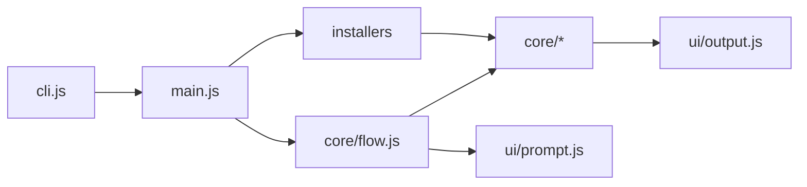
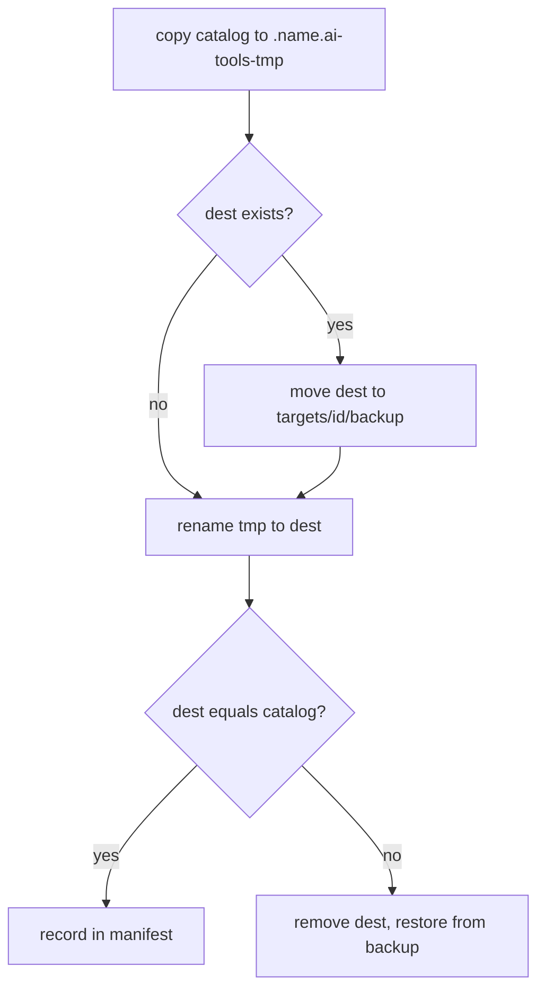

# installer

Source of `install.sh` / `install.cmd`. Plain JavaScript (ESM) for Node >= 20, with no
dependencies and no build step. User-facing usage is in the [root README](../../README.md).

## Layout

```text
cli.js          checks the Node version, then runs main.js
main.js         flags, --help, picks the installer and the action
core/           generic: context, providers, plan (states), fsops, manifest, flow
ui/             output.js (colors, messages) and prompt.js (arrow-key select / multiselect / confirm)
installers/     one module per installer, registered in index.js
types.d.ts      the installer contract (checked by the editor through jsconfig.json)
test/           node:test unit tests
```



- `core/` never imports `installers/`; `ui/` knows nothing about skills.
- Only `ui/prompt.js` reads the keyboard. Its API has the shape of `@clack/prompts`, so it can be
  swapped for that library later.

## Adding an installer

An installer says **what** gets installed and **where**; the core does the rest (scope, providers,
states, plan, confirmation, backup, manifest, `--status`, `--uninstall`).

```js
/** @type {import('../types.js').Installer} */
export default {
  id: 'my-thing',
  label: 'My thing',
  scopes: ['project', 'user'],
  providers: ['claude', 'agents'],
  groups: [{ id: 'stable', default: true }],
  items: () => [{ id: 'a', description: '...', group: 'stable' }],
  units: (item, ctx) => ctx.providers.map((provider) => ({
    item: item.id, provider, kind: 'dir', src: '...', dest: '...', exclude: [],
  })),
};
```

Then add it to `installers/index.js`. Only `kind: 'dir'` exists today; new kinds go in
`core/fsops.js` and `core/plan.js`.

## Installing a unit



## Decisions

- **Node, no dependencies:** runs on macOS, Linux and Windows, and needs no `npm install`.
  JS with a `.d.ts` keeps types without a build step and still runs on Node 20.
- **One folder per destination** (`targets/<folder>-<hash8>/`, or `targets/user/`): projects never
  share a manifest or a backup. Paths in the manifest are relative to its `base`.
- **Only the last run's backup** is kept per destination. Uninstall deletes without a backup.
- **Content comparison** (names, sizes, bytes) decides the state; nothing else is stored, not even
  dates or hashes.
- **No compatibility** with the old bash installer's manifest or flags.
- **English only**; minimal comments.

## Tests

```bash
cd scripts/installer
npm test
source ~/.nvm/nvm.sh && nvm exec 20 npm test    # Node 20
```

Unit tests only (file operations, manifest, states, flags, the selector's key handling). The full
flow is checked by hand with a temporary `HOME` and `AI_TOOLS_HOME`.
