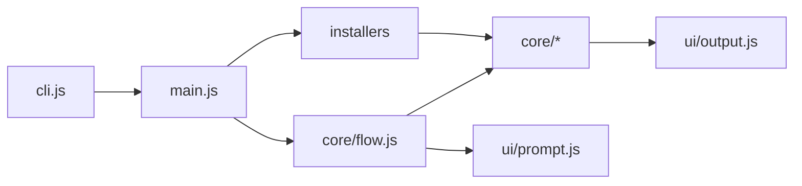
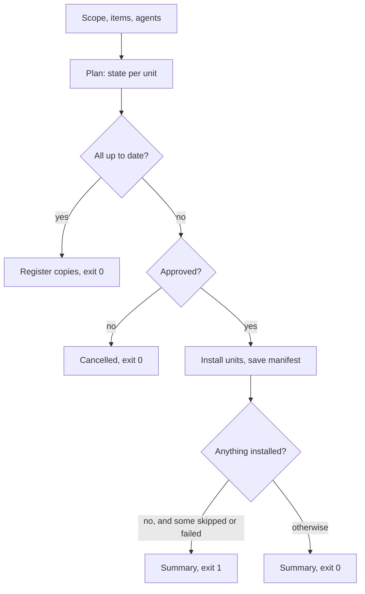
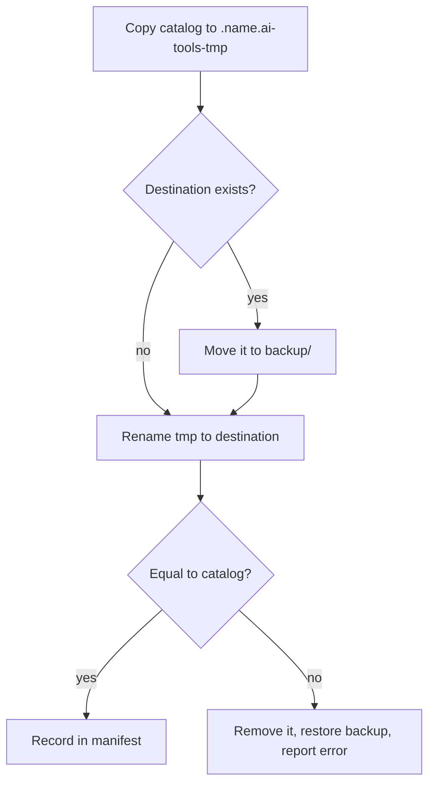

# Installer

> How `install.sh` / `install.cmd` is built and what happens when it runs.

## Table of Contents

- [Overview](#overview)
- [How It Works](#how-it-works)
- [Main Flow](#main-flow)
- [Unit States](#unit-states)
- [Data](#data)
- [Interfaces](#interfaces)
- [Configuration](#configuration)
- [Errors and Edge Cases](#errors-and-edge-cases)
- [Limitations](#limitations)
- [Summary](#summary)

## Overview

The installer copies content from this repo into a project or into the user's home folder, for one
or more agents (`claude`, `agents`, `cursor`, `continue`, `opencode`). It installs skills from
`skills/stable/` and `skills/experimental/`, and the `sdd-lite` harness from `harness/stable/`
into `./sdd-lite/` of a consumer project (not into this catalog, not user-wide).

It is plain JavaScript (ESM) for Node >= 20, with no dependencies and no build step, so the same code
runs on macOS, Linux and Windows. `install.sh` and `install.cmd` are one-line launchers for
`scripts/installer/cli.js`.

It is built to host more installers (agents are still planned): an installer only declares
**what** to install and **where**; the core handles everything else.

## How It Works

| Piece | Responsibility |
|---|---|
| `cli.js` | Checks Node >= 20, then runs `main.js` |
| `main.js` | Parses flags, prints `--help`, picks the installer and the action |
| `core/flow.js` | Runs install, `--uninstall`, `--list` and `--status` |
| `core/plan.js` | Decides the state of each unit |
| `core/fsops.js` | Filtered copy, content comparison, move with backup and restore |
| `core/manifest.js` | Reads and writes the per-destination `manifest.json` |
| `core/context.js` | Scope, project root, canonical paths, destination id, data folder |
| `core/providers.js` | Agent folders per scope and their detection |
| `ui/prompt.js` | Arrow-key `select` / `multiselect` / `confirm` |
| `ui/output.js` | Colors and messages |
| `installers/*.js` | One module per installer, listed in `installers/index.js` |

The core never imports an installer, and `ui/` knows nothing about skills. Only `ui/prompt.js` reads
the keyboard; its API has the shape of `@clack/prompts`, so it can be swapped for that library.



## Main Flow

An install run first picks Skills or Harness (interactive, unless a flag already implies one),
then answers the remaining questions: the scope (project or user), the items and the agents.
A flag answers a question in advance; whatever is missing is asked in a menu. Then it builds a plan
with the state of every unit (one item for one agent) and prints it before touching anything.



Each `kind: 'dir'` unit (skills, and the `sddl-init` copy) is installed the same way. The new
copy is built next to the destination first, so the destination is only replaced by a rename, and
it is verified against the catalog afterwards. A `sync-dir` unit (the sdd-lite package) updates
catalog children in place, leaves `preserve` names (`openspec/`, bootstrap files), and deletes
orphans.



A failed unit is restored and the run continues with the next one; there is no rollback of the whole
run.

## Unit States

The state comes from comparing the destination with the catalog (file names, sizes and bytes) and
from the manifest. Excluded files are ignored on both sides.

| State | Mark | When | What the run does |
|---|---|---|---|
| `new` | | nothing at the destination | installs |
| `up to date` | `=` | identical to the catalog | nothing; registers it if it wasn't |
| `update` | `*` | registered and different | replaces it, with backup |
| `unmanaged` | `~` | exists, not registered, different (also any symlink) | skips it, unless you choose Overwrite or pass `--force` |
| `missing` | `!` | registered but gone from disk | installs it again |

## Data

Everything the installer remembers lives in one folder per destination:

```
~/.config/ai-tools/                 # or $AI_TOOLS_HOME
  targets/
    user/                           # user scope
      manifest.json
      backup/
    app-3f9a1c2b/                   # project scope: <folder name>-<first 8 hex of sha1(path)>
      manifest.json
      backup/.claude/skills/...     # same relative path as in the project
```

- `manifest.json` stores the destination (`scope`, `base`) and one entry per installed unit:
  `installer`, `item`, `provider`, `kind` and `path` relative to `base`. No dates or hashes.
- `backup/` holds only what the last run that replaced something moved away. Uninstall makes no
  backup.
- Folders are created only when something is written; `--list` and `--status` write nothing.

## Interfaces

An installer is an object that follows the contract in `types.d.ts`:

```js
/** @type {import('../types.js').Installer} */
export default {
  id: 'skills',
  label: 'Skills',
  scopes: ['project', 'user'],
  providers: ['claude', 'agents', 'cursor', 'continue', 'opencode'],
  groups: [{ id: 'stable', default: true }, { id: 'experimental', note: '...' }],
  items: () => [/* { id, description, group } */],
  units: (item, ctx) => [/* { item, provider, kind: 'dir', src, dest, exclude } */],
};
```

- `items()` feeds the menu and `--list`; `groups` adds dividers and marks the default selection.
- `units()` says which folder each item writes for each selected agent; the core derives states,
  plan, `--status` and `--uninstall` from it.
- `kind: 'dir'` replaces a folder. `kind: 'sync-dir'` updates a folder in place and keeps
  `preserve` names (used by sdd-lite for `openspec/` and bootstrap files). A new installer is
  added to `installers/index.js`.

The skills installer lists folders with a `SKILL.md` (stable first; an experimental skill with the
same name as a stable one is not offered) and installs each one to `<agent folder>/skills/<name>`,
without `evals/`, `*-workspace`, `README.md`, `USAGE.md` and `.DS_Store`.

The harness installer copies `harness/stable/sdd-lite` to `./sdd-lite/` (`sync-dir`) and
`sddl-init` to `<agent>/skills/sddl-init`. It is project-only, cannot be uninstalled by this
tool, and is not offered when the destination is this catalog repo. After install, run
`sddl-init` in the agent.

## Configuration

| Variable | Effect |
|---|---|
| `AI_TOOLS_HOME` | Data folder instead of `~/.config/ai-tools` |
| `NO_COLOR` | Disables colors (also off when the output is not a terminal) |

## Errors and Edge Cases

| Condition | Result |
|---|---|
| No terminal, or `-y`, and a question has no flag | Error naming the flag to use (agents fall back to the default instead) |
| No terminal and no `-y` at the confirmation | Error: `add -y to confirm` |
| `unmanaged` units with `-y` | Skipped; with `--force` they are overwritten |
| `manifest.json` unreadable | Renamed to `manifest.json.broken`, the run continues with an empty one (`--status` only warns) |
| Move blocked (`EPERM` / `EBUSY`, common on Windows) | Retried up to 5 times, 200 ms apart |
| Destination on another disk (`EXDEV`) | Copy, then delete, instead of rename |
| Nothing selected in a menu | Message, exit 0 |
| Run interrupted | A leftover `.name.ai-tools-tmp` is removed the next time that unit is installed; a registered destination left only in `backup/` shows as `missing` |

Exit codes: `0` success, cancelled or nothing to do; `1` error, or nothing installed because units
were skipped or failed; `130` Ctrl-C in a menu.

## Limitations

- A `dir` update replaces the whole folder. Files added by hand inside an installed skill go to
  `backup/` and are lost on the next run that replaces something in that destination. A `sync-dir`
  update does not replace `preserve` paths.
- Only the last run's backup is kept, and nothing cleans up destinations whose folder no longer
  exists (`--status` lists them).
- Windows support (`install.cmd`, retries, case-insensitive paths) is designed but not yet tested on
  Windows. The `EXDEV` fallback has not been tested either.
- `--skills`, `--all` and `--experimental` are skill-only; using them with `harness` is an error.
- The harness cannot be uninstalled by this tool and cannot be installed user-wide or into this
  catalog repo.

## Summary

The installer is a small Node core plus one module per installer. A run asks what flags did not
answer, shows a plan with one state per unit, and writes destinations (`dir` by verified rename,
`sync-dir` in place), keeping the last run's backup. Its only memory is
`targets/<id>/manifest.json`, so a destination that was not recorded is never removed and is only
overwritten when you say so.
