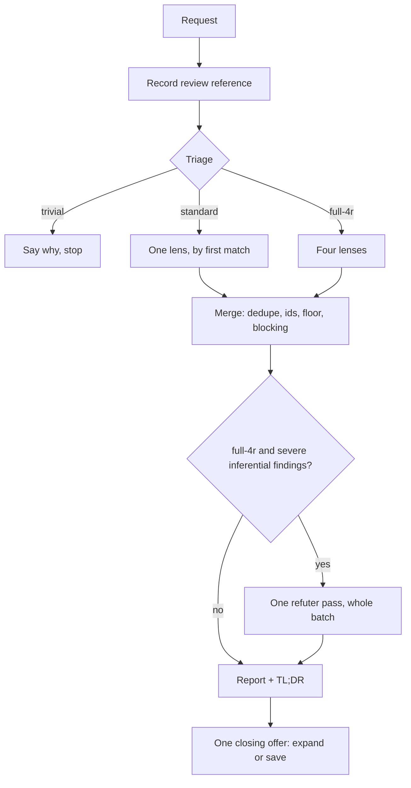

# 4r-review

Risk-tiered code review of a recorded target, across four lenses: **R**isk, **R**eadability,
**R**eliability, **R**esilience.

Triage decides how much review the change actually deserves — from none, through a single lens, to
all four plus a corroboration pass. The output is a chat report; a file is written only if you ask
for one.

The failure mode it exists to prevent is a review that is loud and unactionable: style opinions
dressed as defects, pre-existing problems held against whoever touched the file, and a verdict whose
inputs the reader cannot see.

## Table of Contents

- [When it triggers](#when-it-triggers)
- [The flow](#the-flow)
- [Triage](#triage)
- [What a worker receives](#what-a-worker-receives)
- [The report](#the-report)
- [Gates](#gates)
- [The ledger and fix rounds](#the-ledger-and-fix-rounds)
- [Files](#files)
- [Why it is shaped this way](#why-it-is-shaped-this-way)
- [What it does not do](#what-it-does-not-do)

## When it triggers

**Only by name**: `4r-review`, `4r`, "revisión 4R". Nothing starts it implicitly — not a security
keyword in the diff, not its own size.

During a code review you already asked for, it may be *suggested* once, if the diff that was already
inspected exceeds 600 added-plus-deleted lines or 15 changed files. A suggestion is not a start, it
is never repeated, and continuing the conversation is not consent to run it.

That 600-line suggestion threshold and the 400-line `full-4r` threshold measure different things: one
decides whether to *offer* the protocol at all, the other decides how deep the review goes once you
have chosen it. They are independent and do not need to agree.

## The flow



Everything runs against the review reference recorded in step one — a commit SHA, a range resolved to
SHAs, or a hash of the working-tree diff. If the target changes mid-review, say so and record a new
reference before continuing; a finding that cannot be tied to a recorded reference cannot be re-checked
later.

The target is inferred, not asked about: what you named, else uncommitted changes, else the branch
against its base. The one scope question fires only when that chain has nothing left to resolve.

## Triage

Two ordered tables, both first-match. Neither asks you anything.

**Tier:**

| # | Test | Tier |
|---|---|---|
| 1 | docs, comments, formatting or string typos only, **and** nothing in a directory the project executes, builds from or deploys | `trivial` |
| 2 | a changed path or identifier matches the sensitive list | `full-4r` |
| 3 | more than 400 changed lines | `full-4r` |
| — | anything else | `standard` |

The sensitive list covers auth, sessions, tokens, secrets, permissions, payments, billing, and
migrations or schema changes — plus anything the project's own standards mark as critical.

"Changed lines" means added plus deleted, from `git diff --numstat` against the review reference,
excluding lockfiles, generated output and vendored paths. Binary files count as files, with no
invented line count.

Test 1 carries a deliberate catch: in a repository whose product *is* prose — a prompt library,
markdown configuration, documentation that something executes — a docs-only change is a behavior
change and does not qualify as trivial. The test asks where the file lives, not what it contains.

A `trivial` verdict ends the run: it states what the diff touches and why it qualifies, and stops. No
lenses, no report template, no offer to save.

**Lens, for `standard`:**

| # | Dominant signal | Lens |
|---|---|---|
| 1 | secrets, auth, permissions, data exposure, trust boundaries, new dependencies | `risk` |
| 2 | external calls, retries, timeouts, degradation, migrations, rollback, observability | `resilience` |
| 3 | behavior, state, tests, determinism, error propagation | `reliability` |
| 4 | naming, structure, dead code, behavior-preserving refactors | `readability` |

The order *is* the tiebreak. A diff touching both a new dependency and a retry loop gets `risk`,
because test 1 fires first. A `standard` review is a focused pass over the dominant signal, not an
exhaustive review of every possible concern. It never gets a second lens, and you are never asked to
choose one — that is what the triage is for.

## What a worker receives

Its lens file with the placeholders filled, then `_shared.md`. Nothing else: no conversation history,
no other lens, no accumulated findings.

`_shared.md` carries the definitions of the three fields a worker has to fill and that everything
downstream keys off:

| Field | Decides |
|---|---|
| `severity` | whether the finding can block, be corroborated, or be re-reviewed at all |
| `evidence_class` | whether it goes through the refuter |
| `causal_disposition` | whether it blocks, or is merely reported |

All three enums are defined in full, in the prompt, next to the contract that uses them. A worker
asked to record `causal_disposition: behavior-activated` without ever being told what that means will
produce a value, and the verdict will be computed from it.

`_shared.md` also grants a bounded exception to the worker boundary. Several lens rules are
conditional on a project convention — "where the repo has test infrastructure", "where the repo
documents such constraints" — and settling one means looking past the reviewed diff, which the boundary
otherwise forbids. The allowance is exactly three adjacent files; if that does not settle it, the
condition is unmet and the rule does not fire. Nobody sweeps the repository to establish a norm.

The lenses are written to be disjoint, and each one names the border it shares with its neighbor:
`reliability` owns whether a failure reaches a caller who can act on it, `resilience` owns whether it
is logged; `risk` owns input at the trust boundary, `reliability` owns input already inside it;
`risk` owns auth and data-deletion safety controls, `resilience` owns migrations and rollback. This
matters in `full-4r`, where all four look at the same lines from different angles.

## The report

Compact by default, detailed on request.

| Part | What it carries |
|---|---|
| header | tier, lenses, review reference, scope |
| findings table | **severe findings only**, worst first: id, lens, location, severity, blocks, one-sentence claim |
| info | one line each, outside the table |
| corroboration | `full-4r` only, when a refuter pass ran |
| **TL;DR, last** | the risk in plain words, verdict with counts, blocking ids **with their locations**, next step |

The TL;DR is at the bottom on purpose: by the time you have scrolled past a long table you have lost
the ids, and that block is where you find them again. It repeats the anchors rather than summarizing.

`evidence_class`, `causal_disposition` and `proof_refs` are not printed by default — they arrive when
you ask to expand a finding, together with the smallest change that would fix it. The `Blocks` column
is the part of all three that matters at a glance, so the verdict is never shown without the reason
for it being one column away.

Two columns that stay out unless they say something: `Status` appears only when a row is not `open` —
after a refutation, or in a fix round. And when nothing was found, the table is dropped entirely in
favor of one line naming what was inspected; an empty table reads like a pass that failed to run.

## Gates

**One**, and it comes after the report:

> Puedo expandir cualquier finding o guardar esto en `docs/reviews/…`. ¿Alguna de las dos?

The expansion half is offered only when a severe finding exists — there is nothing to expand
otherwise. The path is proposed only when a `docs/` directory exists; otherwise it asks, rather than
assuming a convention the project may not follow.

Nothing else interrupts. The mode is never asked about, the language is detected rather than
confirmed, and the target is inferred.

## The ledger and fix rounds

Off by default. When you accept, the ledger is the report made durable — the same content, no extra
fields — with a five-line digest and a seven-column findings table, written in English so the file
stays readable to whoever opens the repository later.

It carries no round counter and no next-action digest. Those fields only pay off if something reads
them back, and nothing here does.

So the fix round states its precondition instead of assuming one: it needs the ledger file **or** the
report still present in this conversation. Without either, it says so and runs a fresh review rather
than pretending to be a continuation. There is no fixed round count: continue only while the user
supplies meaningful new deltas and findings or verification work remains, and stop when no progress
is possible. A delta that proves the correction can move a finding directly from `open` to `verified`;
otherwise it stays `fixed` until later evidence verifies it. An unverifiable claim of verification is
worse than an honest `fixed`.

## Files

```
4r-review/
├── SKILL.md                    record · triage · dispatch · merge · report · close · fix round
├── references/
│   └── ledger.md               loaded only when you accept saving
└── assets/lenses/
    ├── _shared.md              severity, evidence class, causal disposition, contract, boundary
    ├── risk.md  readability.md  reliability.md  resilience.md
    └── refuter.md              full-4r only; deliberately does NOT get _shared.md
```

One file per lens, because the runtime reads whole files: anything bundled with a lens you did not
select is loaded and unusable. What each tier actually pulls in, beyond `SKILL.md`:

| Tier | Loaded |
|---|---|
| `trivial` | nothing |
| `standard` | ~95 lines — `_shared.md` plus the one selected lens |
| `full-4r` | ~195 lines — `_shared.md`, four lenses, the refuter |

The refuter is the one worker that does **not** receive `_shared.md`. Its output shape is `results`,
not findings rows, and handing it the findings contract invites it to write rows it is not allowed to
write.

## Why it is shaped this way

- **Reference first.** Nothing is analyzed before a review reference exists.
- **Tier and lens come from ordered tests, not from feel.** Two runs over the same diff review it the
  same way and reach the same verdict. Where a rule exists, it beats a better idea in the moment.
- **Only a defect this change introduced, activated or worsened can block.** Everything else is
  reported and never held against the change. A review that blames the author for the repository's
  history stops being worth running.
- **Every enum that drives a decision is defined where the decision is made.** A field whose values
  are listed but never explained will be filled anyway, and the verdict will be computed from it.
- **The reader sees the inputs to the verdict**, not just the verdict.
- **Precision over volume.** Only real, defensible, user-impacting defects. Style findings are banned
  unless they obscure one, and the standard is always the surrounding code.
- **Budgets are hard caps** for review passes: one sweep per lens and one refuter pass over the whole
  batch. Fix rounds have no fixed count; they continue only while the user supplies meaningful new
  deltas and findings or verification work remains.
- **Read-only.** Fixes are described and never applied.
- **State is optional, and the skill says which mode it is in.** A review with no ledger and no
  conversation behind it is a new review, and it says so.

## What it does not do

- It does not apply fixes. Ever. It describes the smallest change and hands it back.
- It does not assess prose or documentation quality — a `trivial` verdict on a docs diff is a skip,
  not a judgment about the writing.
- It does not know what other reviews exist. Deciding not to review the same change twice is yours.
- It does not carry a review across conversations beyond the ledger file, and says so rather than
  pretending otherwise.
- It does not choose its own depth beyond the triage tables, and it does not widen scope to justify a
  finding.
