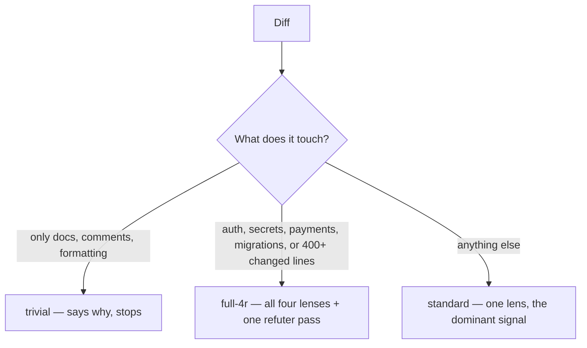

# 4r-review — usage

A risk-tiered code review across four lenses: **R**isk, **R**eadability, **R**eliability,
**R**esilience. It sizes itself to what the change actually risks, instead of running the same
checklist on every diff.

## When to use it

- You want a review sized to risk, not a fixed checklist — a docs typo gets skipped, an auth change
  gets all four lenses plus a corroboration pass.
- You want findings with a severity, whether each one blocks, and why — not just a list of comments.

## When not to

- You just asked for "review this" — that's a different skill (`code-review`). Name `4r-review`
  explicitly if this is the one you want.
- You want a second, independent opinion on the same change — that's `judgment-day`.

## How to invoke

Only by name: `4r-review`, `4r`, "revisión 4R". It never starts on its own. During a review you
already asked for, it may suggest itself once if the diff exceeds 600 changed lines or 15 files — that
is an offer, not a start.

## What happens after you ask



You are never asked to pick the tier or the lens — the diff decides.

## What you'll be asked

One question, after the report: expand a finding with its evidence and a suggested fix, and/or save
the review to a file. Nothing else interrupts.

## Minimal example

> "4r review de esto" — a 110-line diff touching a login handler

```
## 4R Review — feature/login-retry
**Tier:** full-4r · **Lenses:** risk, readability, reliability, resilience
**Reference:** a1b2c3d · **Scope:** 3 files, ~110 lines

### Findings
| Id | Lens | Location | Severity | Blocks | Claim |
|---|---|---|---|---|---|
| R1-001 | risk | auth.ts:42 | BLOCKER | yes | token compared with == instead of a constant-time check |

---
**TL;DR** — one timing-attack-shaped issue in the new retry path; everything else is clean.
**Verdict:** fail — 1 severe, 0 info
**Blocking:** R1-001 `auth.ts:42`
**Next step:** fix the comparison before merging
```

---

For how the triage tests work, what each lens looks for, and why it's shaped this way, see
[README.md](./README.md).
