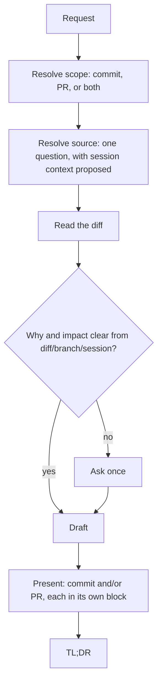

# commit-closer

Turns a resolved set of changes into a commit message, a PR description, or both — grounded in
what git actually shows, read-only, never writing anything back.

The work is picking the right source without guessing, keeping the drafted text readable instead
of technical, and never touching git beyond looking at it.

## Table of Contents

- [When it triggers](#when-it-triggers)
- [The flow](#the-flow)
- [Resolving the source](#resolving-the-source)
- [What the commit message looks like](#what-the-commit-message-looks-like)
- [What the PR description looks like](#what-the-pr-description-looks-like)
- [The one question, twice at most](#the-one-question-twice-at-most)
- [Files](#files)
- [Why it is shaped this way](#why-it-is-shaped-this-way)
- [What it does not do](#what-it-does-not-do)

## When it triggers

Explicit invocation, or a request to write a commit message or a PR description. It suggests
itself — without starting — when asked to prepare a commit or PR without a specific drafting
request. Analyzing what changed, on its own, is not a drafting request.

## The flow



## Resolving the source

Every run checks, read-only, what actually has changes: staged, working tree (including untracked
files), the current branch against its resolved base, and whether the repository has any commits
at all. It also looks at what the session already worked on.

That check feeds exactly one question — asked every time, even when only one source has changes —
listing every source that qualifies with its file count, and proposing one based on the session.
An explicit commit range is always an available escape hatch. When a PR is in scope, the same
question folds in whether to include validation steps, instead of asking that separately later.

A repository with no commits yet drops every command and source that depends on `HEAD` and works
from staged and working-tree changes only.

## What the commit message looks like

One line by default: `type(scope): summary`, imperative, no trailing period, lowercase after the
colon, 72 characters total. The type is chosen by first match — `fix` before `feat` before `perf`
before `refactor`, with `docs`/`test`/`ci`/`build`/`style` only when the entire change is that
kind, `chore` as the fallback.

A body is added only when the change spans several areas, has a side effect the summary doesn't
convey, or the reasoning is worth keeping — two to four sentences, the problem and then what
changes, never how it was implemented, and never a file path, function, or line number. A name
appears only when it identifies something recognizable, like an endpoint or a command.

One message is recommended; two alternatives change the framing (mechanism vs. symptom, for
example), each with a one-line note on how it differs — the format never changes between them.

## What the PR description looks like

Four possible sections, in `assets/pr-description.md`: What (grouped by topic, never a file table),
Why (short), Impact (conditional — only when the change affects a contract, data shape,
configuration, or capability something else depends on; touches a flow outside what "What"
describes; or spans enough areas that a problem in one could hide behind review of another — size
alone does not qualify), and How to validate (only if chosen in the source question, short numbered
steps that each name a concrete check).

## The one question, twice at most

A run asks at most two questions: the source question in Step 2, and — only if the diff, branch,
and session together don't already make the reason and impact clear — one question about why in
Step 4. Neither is a menu of follow-ups; each is asked once, covers everything it needs to, and the
run continues once answered.

## Files

```
commit-closer/
├── SKILL.md              the flow: scope, source, read, why, draft, present
└── assets/
    └── pr-description.md    the PR sections, with an example
```

`pr-description.md` loads once, only when a PR description is in scope.

## Why it is shaped this way

- **Read-only with git is not a suggestion, it's absolute.** Drafting text and changing repository
  state are different jobs; this skill only does the first one, and never offers the second.
- **The source is asked, not assumed — but asked once, with a proposal.** Guessing which changes
  the user means risks drafting the wrong thing; asking without a proposal every time is friction
  the session's own context can usually resolve.
- **The commit message favors one line because most changes deserve one line.** A body is a
  decision, not a default — it's added when there's something a one-line summary genuinely can't
  carry.
- **No file paths, function names, or line numbers in either output by default.** A commit message
  or PR description is read by someone deciding whether to trust a change, not someone reading the
  diff — the diff already has the paths. A name earns its place only by identifying something a
  reader would recognize on its own, like an endpoint or a flag.
- **Impact is conditional, not automatic.** A section that appears on every PR regardless of
  content stops meaning anything; it shows up only when the change actually reaches beyond what
  "What" already said.
- **Two questions, not five.** The skill it replaced could ask before reading anything, again to
  clarify, again to pick a commit, again about earlier commits, and again to confirm a list. Here,
  one question resolves the source (and, when relevant, whether to validate), and a second asks
  only what the diff couldn't already answer.
- **No project-specific defaults survive here.** Scopes, hook names, and doc paths belonging to one
  project were removed rather than replaced with another guess — a skill this generic keeps nothing
  it can't verify from the repository itself.

## What it does not do

- It does not run or suggest any git command that writes — no `add`, `commit`, `push`, or `stash`.
- It does not draft both a commit message and a PR description unless both were asked for, or the
  request didn't say which one.
- It does not print a file table in a PR description.
- It does not invent a ticket number, a `BREAKING CHANGE` footer, or a risk statement without
  something in the diff, the branch, or the conversation behind it.
- It does not ask what changed — that always comes from the diff.
