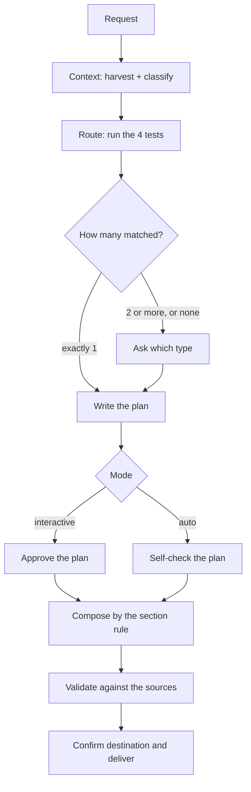

# doc-writer

Turns whatever context is available — the session, code, a diff, a spec, files you point at — into a
Markdown document grounded in the sources instead of filled in from what usually goes in that section.

The work is deciding **what matters**, **what shape holds it**, and **what can honestly be claimed**.
Rendering Markdown is the last step and the cheapest one.

Three things that usually rest on judgment are decided by rule here, so that two runs over the same
material produce the same document: which type it is, which sections exist, and how long it gets.

## Table of Contents

- [When it triggers](#when-it-triggers)
- [The flow](#the-flow)
- [How the type is chosen](#how-the-type-is-chosen)
- [Which sections end up in the document](#which-sections-end-up-in-the-document)
- [Document length](#document-length)
- [Modes and gates](#modes-and-gates)
- [Templates](#templates)
- [Files](#files)
- [Rules that shape the output](#rules-that-shape-the-output)
- [What it does not do](#what-it-does-not-do)

## When it triggers

Anything that asks for something to be written up: "documentá esto", "document this", "armá un doc",
"write it up", "dejalo registrado" — and any named shape: system or module doc, ADR, investigation,
report.

You can also call it by name: `doc-writer`, `doc-writer auto`.

## The flow



1. **Context** — reads the session, the files you named, the diff, and what those directly reference.
   Nothing else. Builds an internal context map (goal, audience, scope, sources, facts, unknowns,
   conflicts, discarded) and stops when every Core fact either has a source or sits in `UNKNOWNS`.
   Every fact gets an evidence level and a relevance level.
2. **Route** — four ordered tests decide the type. See below.
3. **Plan** — the contract: type, goal, audience, detail level, sources, structure, visuals,
   exclusions, unknowns, conflicts. Cheap to fix here, expensive after ten sections.
4. **Compose** — sections come from the rule, not from taste. Visuals only if the plan called for them.
5. **Validate** — re-reads the **sources**, not the draft, and fixes or deletes what does not hold.
6. **Deliver** — confirms where it goes, then reports what was left out, what stayed unknown, and any
   conflict it documented instead of resolving.

## How the type is chosen

All four tests are evaluated — the count decides whether you get asked.

| # | Test | Type |
|---|---|---|
| 0 | you named the type | that one |
| 1 | a question was answered with evidence | `investigation` |
| 2 | a decision was made between alternatives | `adr` |
| 3 | the subject is work done over a bounded period | `report` |
| 4 | the subject is something that exists and has to be explained | `system` |
| — | nothing matched | `generic` |

| Matches | What happens |
|---|---|
| exactly 1 | that type, no question |
| 2 or more | you get asked, with the matched types as the options |
| 0 | falls to `generic`, and you get asked |

In interactive mode that question is folded into the plan gate, so it costs no extra interruption. In
auto mode it is asked on its own — that is the one place auto stops before writing, and it exists
because auto has no plan gate to catch a badly inferred type.

## Which sections end up in the document

Not a judgment call:

| Section | Rendered when |
|---|---|
| in the template's `required` | **always** — if the sources cannot fill it, it carries one line: `No establecido: <what is missing and what would confirm it>` |
| in the template's `optional` | **only if ≥1 confirmed fact** maps to it |
| in neither | **only if ≥3 confirmed facts** need a home the template does not offer |

Exception: `generic` declares `content: free`, so its content sections come from the material's own
structure.

This is what keeps filler out. A required section with nothing behind it becomes a stated gap, which
is information. The alternative — filling it from plausibility — is a liability, because the reader
has no way to tell which sentences were grounded and which were plausible.

## Document length

**Length is a consequence, never a target.** No confirmed, relevant fact gets cut to reach a size.
When the material overflows — two or more required sections each needing heavy depth, or facts about
two different subjects — the plan proposes **splitting into two documents** instead of trimming.

One dial, shown on every plan as `DETALLE`:

| | `normal` | `extendido` |
|---|---|---|
| examples | minimal fragment | complete (whole request/response, command with its output) |
| per-item subsections | no | yes, when an item has ≥3 facts of its own |

`extendido` activates **only when you ask for it** ("detallado", "completo", "extenso") — never
inferred from the size of the material. Since the line is always in the plan, you can flip it at the
gate without knowing the parameter name.

## Modes and gates

Auto only when you ask for it explicitly. Otherwise interactive. **It never asks which mode you want.**

| Mode | Typical | Worst case |
|---|---|---|
| interactive | 2 — plan, destination | 2 — an ambiguous type folds into the plan gate |
| auto | 1 — destination | 2 — ambiguous type, then destination |

Auto skips the plan gate; it does not write without confirming where the file lands. A conflict
between sources is never a gate — it goes into a "Known inconsistencies" table and the document keeps
going.

## Templates

Five, in `assets/templates/`, discovered at runtime:

| Template | For | Required sections |
|---|---|---|
| `system` | something that exists: a system, module, section or capability | overview, how it works, main flow, summary |
| `investigation` | a question answered with evidence | question, evidence, findings, rejected hypotheses, conclusion |
| `adr` | one decision, its alternatives and its cost | context, decision, alternatives considered, consequences |
| `report` | work done over a bounded period | executive summary, scope, what changed, problems encountered, current state, open work |
| `generic` | material that fits none of the above | overview, summary |

`system` is deliberately broad: a whole system, one module, a section and a single capability all get
the same shape. Splitting those into separate templates makes the choice harder without making the
documents different — what actually distinguishes them is depth, and depth lives in the optional
sections, gated by the section rule.

There is no dedicated API-reference or runbook shape. Both are structurally distinct enough to earn
their own template if you write them often; until then they fall to `generic`, whose `content: free`
lets the material set its own structure.

### Frontmatter

Five fields, all of them consumed by the skill:

```yaml
---
id: system            # matches the filename
required: [...]       # section ids rendered always
optional: [...]       # section ids rendered only with a confirmed fact behind them
closing: summary      # which section lands the document
toc: auto             # auto (TOC at ≥5 sections) | disabled
---
```

Section ids are internal identifiers, not heading text — headings get written in the document's
language. What is checked is that the slot exists.

The body scaffolds only the required sections. Optional sections live in a trailing comment block with
their exact heading and one line of guidance each, so they are available without sitting in the file
as empty scaffolding inviting to be filled. All guidance is in HTML comments, so it cannot leak into
the delivered document.

### Adding one

Copy the closest template, edit it, drop it in `assets/templates/`. Then add a test for it to the
route in `SKILL.md`.

Templates are **not** auto-selected by prose matching. A template with no test in the route can only
be reached by name — which is a legitimate way to ship a rare shape without adding to the burden of
choosing.

## Files

```
doc-writer/
├── SKILL.md                    the flow: context, route + plan, compose, validate, deliver
├── references/                 loaded only when the document needs them
│   ├── visuals.md              mermaid vs ascii, complexity budget, the no-invention guard, tables
│   └── validation.md           three passes, grounding first
└── assets/templates/           the five templates
```

`visuals.md` loads when the plan's `VISUALS` line is non-empty, and not otherwise — a mechanical
trigger rather than a judgment about the material.

## Rules that shape the output

- **Evidence before completeness.** An empty section is information. A filled-in one is a liability.
- **Rules over judgment.** Where a rule exists, it beats a better idea in the moment. That is what
  makes two runs over the same material produce the same document.
- **Relevance over volume — never length over content.**
- **Never invent — least of all in a diagram.** A box with an arrow and a `1..N` reads as verified, and
  the reader builds on it.
- **Conflicts get stated, not resolved by preference.**
- **When the sources run out**: omit, then qualify, then ask. Never invent.

## What it does not do

- It does not review or update existing documentation against current code. That is a different
  problem — read the doc, read the code, report the drift — and this skill writes rather than checks.
- It does not draw diagrams as a standalone request.
- It does not maintain what it writes. A document goes stale the moment the code moves.
- It does not carry a dedicated API-reference or runbook shape; that material falls to `generic`.
