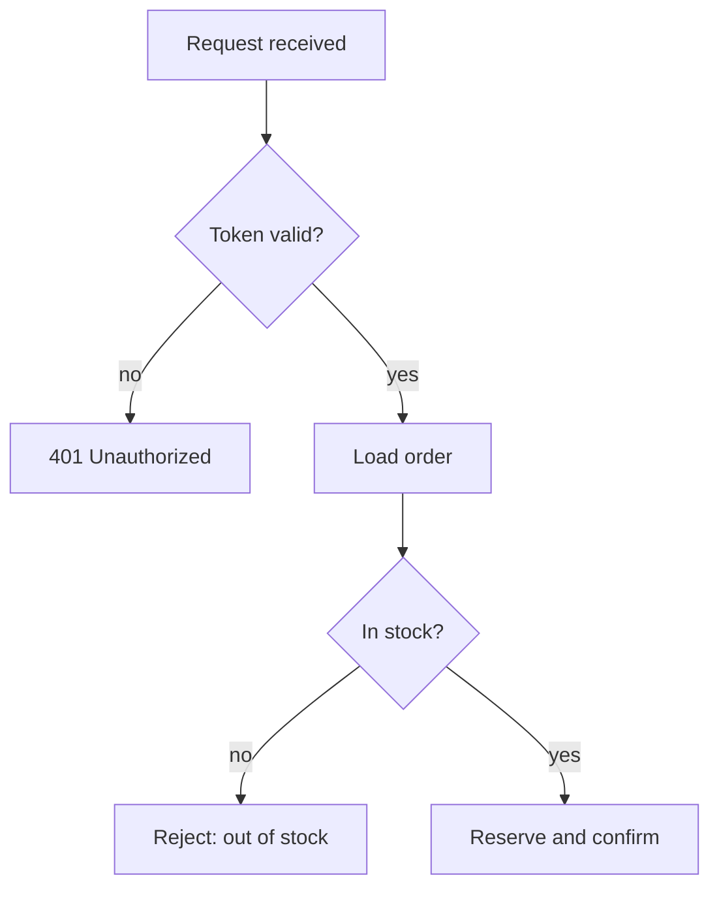
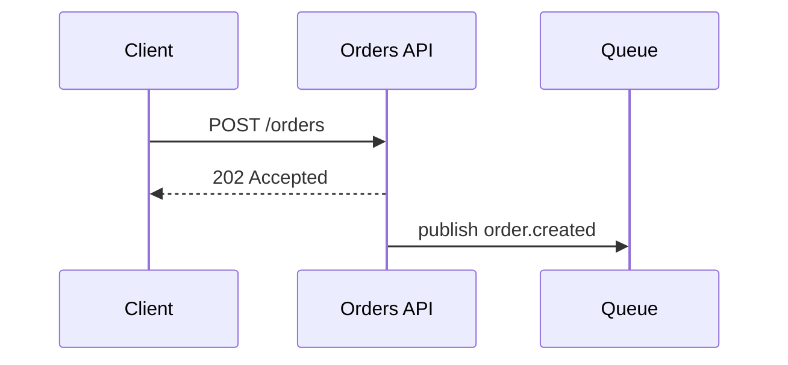
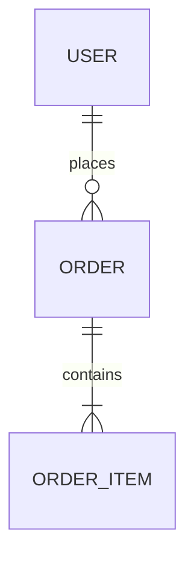
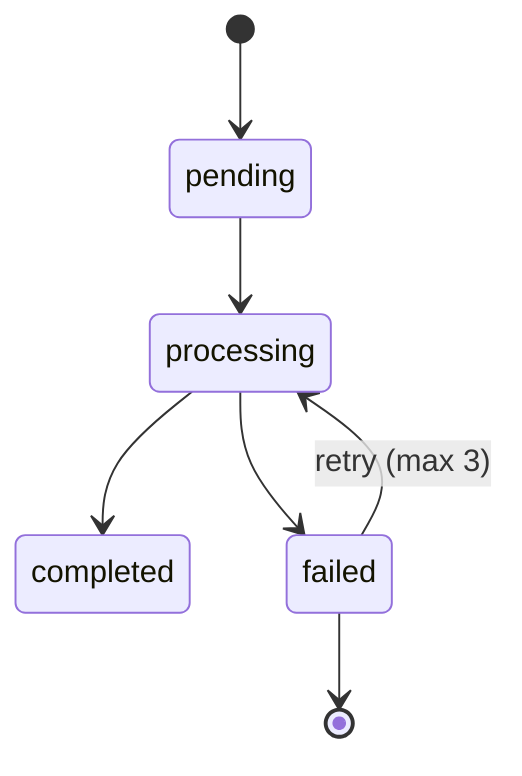

# Visuals

Read this when the plan's `VISUALS` line is non-empty. If it is empty, this file is context spent for
nothing.

Contents:
- [The invention guard](#the-invention-guard)
- [Which format, by material](#which-format-by-material)
- [Complexity budget](#complexity-budget)
- [Per-diagram rules](#per-diagram-rules)
- [Syntax check before delivering](#syntax-check-before-delivering)
- [Tables](#tables)

## The invention guard

A visual may **simplify** what is known. It may never **invent**: no component, relationship,
cardinality, ordering, dependency or state transition that no source establishes.

This is stricter for diagrams than for prose, because of how they are read. Prose can hedge — "orders
appear to belong to a single user" — and the hedge survives. A box with an arrow and a `1..N` reads as
a fact somebody verified, and the reader builds on it. When you reach for a cardinality because it is
the usual one, that is the moment the diagram stops being documentation.

Three ways out, in order:

1. Leave the unknown part out and note it in the prose under the diagram.
2. Mark the edge as unverified (`-.->` plus a note, or a `?` on the cardinality) so the reader sees
   exactly which part is soft.
3. Drop the diagram and use a table of what is known.

Also honest, and often right: a diagram covering the five confirmed components, with the prose saying
the remaining two were not established.

## Which format, by material

| Material | Format |
|---|---|
| directory tree, containment hierarchy | **ASCII** |
| linear pipeline of ≤3 steps, no branches | **numbered list — no diagram** |
| steps with branches, retries, fallbacks | `flowchart TD` (`LR` when it is a pipeline) |
| messages between actors over time | `sequenceDiagram` |
| entities and their relations | `erDiagram` |
| a lifecycle: statuses and transitions | `stateDiagram-v2` |
| components, boundaries, what talks to what | `flowchart` with `subgraph` |
| comparison, configuration, errors, inventory | table |
| the same content as an adjacent table or list | **nothing — keep one** |

Mermaid is the default for anything with real structure: it stays editable and renders in most
viewers. **ASCII is only for trees and containment hierarchies** — a Mermaid graph of a directory tree
is strictly worse than this:

```
src/
├── api/
├── domain/
│   ├── user/
│   └── payment/
└── infrastructure/
```

Never hand-draw an ASCII box diagram. It is unmaintainable and the first edit misaligns it.

Signals in the source material that point at each diagram: *flowchart* — "if", "otherwise", "retry",
"fallback", "validate", "pipeline". *sequence* — client, server, request, response, callback, queue,
webhook. *ER* — entity, table, foreign key, belongs to, owns. *state* — pending, processing, failed,
completed, cancelled, expired. *component* — module, service, layer, boundary, adapter, gateway.

## Complexity budget

Hard limits. A diagram past them is not more complete, it is unreadable.

- **≤10 nodes per diagram.** Past that, split along a real boundary in the system — a process, a
  deployment unit, a network zone — never for visual tidiness.
- **1 diagram per section.**
- **≤3 linear steps takes no diagram.** A numbered list is faster to read and to edit.
- **Every decision edge carries its condition** (`-->|invalid|`). An unlabeled fork tells the reader a
  decision exists without saying what decides it.
- **Every path terminates**, including the failure ones.
- **Labels stay short.** The explanation goes in the line of prose above, which is mandatory: a
  diagram that has to be interpreted unaided is a puzzle.
- **`subgraph` only where a real boundary exists.** Subgraphs invented for tidiness read as
  architecture.

Two or three diagrams that carry weight beat six that decorate — each one costs the reader a context
switch.

## Per-diagram rules

**Flowchart.** `TD` for a process, `LR` for a pipeline.



**Sequence.** One participant per real actor, named as the system names them. Solid arrows for calls,
dashed for responses. Show async as async only when a source says it is — turning a synchronous call
into a queue on a diagram is an invented architecture.



**ER.** Only entities whose relations you can source. Cardinality is the highest-risk field here: a
foreign key proves a relation exists, not that it is `1..N`.



**State.** Include the terminal states and the failure transitions; the happy path is rarely what
needed a diagram. An unknown transition out of a state is a finding, not a gap to fill.



## Syntax check before delivering

A broken Mermaid block renders an error box, which is worse than no diagram. Re-read every fenced
block and confirm:

- brackets and parentheses balanced, every arrow well formed
- labels containing spaces, punctuation or reserved words (`end`, `graph`, `class`, `state`) are
  quoted
- participants and nodes declared before they are used
- the fence is tagged `mermaid`
- the diagram and the prose around it say the same thing — when you edit one, edit the other

## Tables

A table is a claim that every row has the same shape. When that is true it is the densest form
available; when it is false it forces padded cells and an inconsistent grid.

| Material | Form |
|---|---|
| several items sharing the same attributes | table |
| options compared on fixed criteria | table |
| one item with many attributes | prose or definition list |
| items whose explanations run to a paragraph | headed subsections |
| a sequence where order carries meaning | numbered list |
| two rows | prose — the table costs more than it saves |

The test: could a reader answer a question by scanning one column? If they have to read every cell in
full, the grid adds structure without adding access.

**Writing rules.**

- Header says what the column holds, not a generic label. `Purpose` beats `Description` when the
  column holds purposes.
- One fact per cell. A cell with a semicolon list is a missing column or a missing row.
- Consistent grain — do not mix a module and a function in the same `Component` column.
- Code style for identifiers: paths, variables, endpoints, types.
- Empty means unknown, and say which kind: `—` for not applicable, a note under the table for not
  established. A blank cell is ambiguous between the two.
- Drop a column you cannot fill for most rows. A column of "unknown" says nothing a note would not say
  better.
- Sort deliberately — by importance, by call order, by lifecycle. Source-file order is a default, not
  a decision.
- Tables over ten rows get an intro line saying what to look for.
