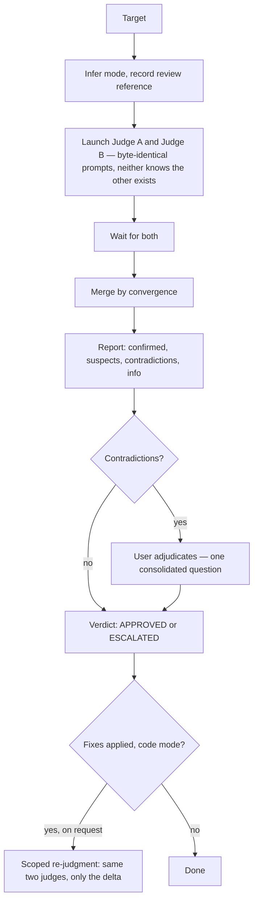

# judgment-day

An adversarial dual review: two blind judges read the same review reference in isolated contexts, and their
convergence — not either judge alone — decides what counts. Agreement confirms a finding, a solitary
report stays suspect, and an incompatible claim between the two escalates to a person instead of getting
silently resolved by preference.

The work is producing two isolated blind readings, merging them by a rule instead of by judgment, and
never printing a verdict the adjudication hasn't earned yet.

## Table of Contents

- [When it triggers](#when-it-triggers)
- [The flow](#the-flow)
- [Mode](#mode)
- [What a judge receives](#what-a-judge-receives)
- [Convergence buckets](#convergence-buckets)
- [The report](#the-report)
- [Close](#close)
- [The ledger and scoped re-judgment](#the-ledger-and-scoped-re-judgment)
- [Files](#files)
- [Why it is shaped this way](#why-it-is-shaped-this-way)
- [What it does not do](#what-it-does-not-do)

## When it triggers

Only explicit requests: naming the skill, asking for "juicio final", or asking for two blind
reviewers on one target. It never starts on its own — a generic second opinion or "judge this" is not
by itself a request for two blind passes.

## The flow



## Mode

Inferred without asking, first match wins:

| # | Signal | Mode |
|---|---|---|
| 1 | the user named it explicitly | that one |
| 2 | exactly one document named, no diff/branch/range | `artifact` |
| 3 | a diff, branch, commit range, or PR | `code` |
| — | still unclear | ask one scope question, then stop |

A PR that only touches one document is still `code` — a PR is a change, not a standalone artifact, even
when its content happens to be prose.

`artifact` mode has no fix loop and no re-judgment: a revised document is a new run, because there is no
delta to freeze against a moving target the way there is with a diff.

## What a judge receives

Exactly one prompt: the round-one (or scoped re-judgment) template with a shared contract file appended
— the severity table, the evidence-class table, the causal-disposition table, and the findings YAML
shape plus explicit criterion assessments. Every judge gets the same contract every run, because a judge that has to assign a severity or a
causal disposition it was never given will invent one, and an invented enum breaks the convergence match
before it starts.

Neither judge's prompt mentions the other pass. The only difference between the two launches is
bookkeeping the orchestrator keeps to itself — which subagent produced which result — never text either
judge reads. That is the actual blindness mechanism: not a rule asking for restraint, but two prompts
with nothing in them to leak. This is context isolation, not statistical independence: the same model
and prompt may share errors or biases.

## Convergence buckets

| Bucket | Condition | Effect |
|---|---|---|
| `confirmed` | both judges report the same defect, both severe | opens; eligible for a fix; severity is the higher of the two |
| `suspect` | exactly one judge reports it severe | recorded, never blocking, never auto-trusted |
| `contradiction` | incompatible claims about the same location | escalated to the user, never picked by preference |
| `info` | any `WARNING`/`SUGGESTION` | reported once, gates nothing |

A finding is severe only at `BLOCKER` or `CRITICAL`. One judge severe and the other mild at the same
location is a `suspect` with a note, not a `contradiction` — a contradiction is two judges disagreeing
about what happened, not two judges disagreeing about how much it matters. Explicit `correct` versus
`broken` assessments expose that disagreement even when one judge has no finding row; `not_assessed`
is not approval.

## The report

Confirmed and suspect findings render as one-row tables — the evidence, the causal disposition, and a
suggested fix live behind an explicit expansion request, never inline by default. Contradictions are the
one thing kept in full: both judges' claims and evidence, side by side, because only the user can
resolve one, and asking them to request the detail they need to do that would just add a round trip to
something the report already owed them.

A TL;DR closes every report and repeats the anchors — the ids and locations that matter — because by the
time someone has scrolled a long report with several findings, those are exactly the details they've lost
track of.

The printed verdict is `PENDING ADJUDICATION` for as long as a contradiction sits unresolved; it becomes
`APPROVED` or `ESCALATED` only once every contradiction has an answer. A verdict printed before that is a
verdict the report hasn't earned yet.

If a judge is still missing or malformed after one retry (two attempts total), the report shows
`Run status: INCOMPLETE` and does not print a target verdict. This operational status is separate from
`APPROVED`/`ESCALATED`.

When the first pass already has a confirmed severe finding, the verdict is `ESCALATED`; use
`Action: CHANGES REQUIRED` only when remediation is requested. `Action` is separate from the verdict.

## Close

One question, asked once, after the report: resolve any open contradictions, and optionally expand a
finding or persist a ledger. Everything that could need a reply is folded into that single turn — there
is no second round of "anything else?" waiting after it.

## The ledger and scoped re-judgment

Persisting is optional and off by default; the ledger is the chat report made durable, not a second
source of truth, so it carries no field the report doesn't already show. A scoped re-judgment needs one
of two things in front of it — the persisted ledger, or the conversation still holding the report —
and says plainly which one it found instead of assuming.

When it runs, both judges see only the frozen findings and the fix delta — never which judge originally
reported which row, because a judge that can see the other's earlier authorship is no longer blind for
that pass. Capped at two fix rounds and two scoped re-judgments; whatever is still open after that is
`ESCALATED`.

## Files

```
judgment-day/
├── SKILL.md                    the flow: freeze, launch, merge, report, close, re-judgment
├── assets/
│   └── judge-contract.md       severity, evidence class, causal disposition, the findings shape —
│                                appended to every judge prompt, every run
└── references/
    ├── judge-prompts.md        the round-one prompt, both criteria blocks, the re-judgment prompt
    └── ledger.md                persistence only, loaded only if the user opts in
```

`judge-contract.md` loads twice on every run regardless of mode — it is the one file every judgment
needs. `ledger.md` loads at most once, only on an explicit yes to persisting.

| Path taken | Loaded |
|---|---|
| every run | `judge-prompts.md` once (~120 lines) + `judge-contract.md` twice (~70 lines each) |
| + persistence | `ledger.md` once more (~70 lines) |

The contract is the one file duplicated across the two launches, and deliberately so: appending the same
severity, evidence-class and causal-disposition definitions to both prompts is what lets two isolated
subagents assign the same fields the same way, which is the entire premise convergence relies on.

## Why it is shaped this way

- **A judge that never hears about the other judge cannot be swayed toward consensus.** Telling a judge
  "another reviewer is scoring the same target, and agreement is what counts" is information about the
  mechanism, and information about the mechanism nudges behavior — toward hedging, toward safer claims,
  toward matching what a judge expects the other to say. The prompt says nothing about it.
- **A judge that never receives the severity or causal-disposition definitions cannot assign them
  honestly — it can only guess.** The contract travels with every prompt, not behind an opt-in flag,
  because the fields it defines gate the entire merge.
- **Contradictions are never behind an expansion request.** Everything else in the report can wait for
  the user to ask for it; a contradiction cannot, because the verdict is not final until it is resolved,
  and asking someone to request the information they need to resolve something just delays the thing the
  report exists to produce.
- **One consolidated close, not a chain of questions.** Adjudication, expansion, and persistence are
  three different things that could need an answer — they arrive in one turn, not three.
- **Two judges are blind by construction, not by discipline.** The isolation comes from what the prompts
  do not contain, not from an instruction asking a judge to behave as if isolated. A re-judgment strips
  judge authorship from the rows it sends back in for the same reason.
- **A scoped re-judgment never re-reviews the original target.** It sees only the frozen findings and the
  fix delta, because reviewing the whole target again would produce the same findings at the cost of a
  full pass, and because judging fresh material outside the delta is scope the re-judgment doesn't have.
- **State is optional, and the skill says so instead of contradicting itself.** A persisted ledger exists
  only if asked for; nothing about that default is treated as a gap to apologize for.
- **The ledger holds only what gets read back.** A field nothing in the flow consumes is not state, it is
  decoration that looks like state — and decoration that looks like state is worse than no field at all,
  because it invites someone to depend on it later.
- **Two judges convergence corroborates; nothing else does.** There is no separate refuter pass and no
  corroboration log restating the same bucket in different words — agreement between two isolated
  reads is the entire corroboration mechanism this protocol has, and it is stated exactly once.

## What it does not do

- It does not run without an explicit request — no diff size, no risk signal, nothing contextual starts
  it on its own.
- It does not apply a fix. Every fix is described, in code mode only, and only on request.
- It does not pick a side in a contradiction. That decision is the user's, every time.
- It does not re-judge an artifact. A revised document gets a new run, not round two.
- It does not resume across conversations. A scoped re-judgment needs the report or the ledger in front
  of it; a ledger reopened later is a record of what was found, not a judgment still in progress.
