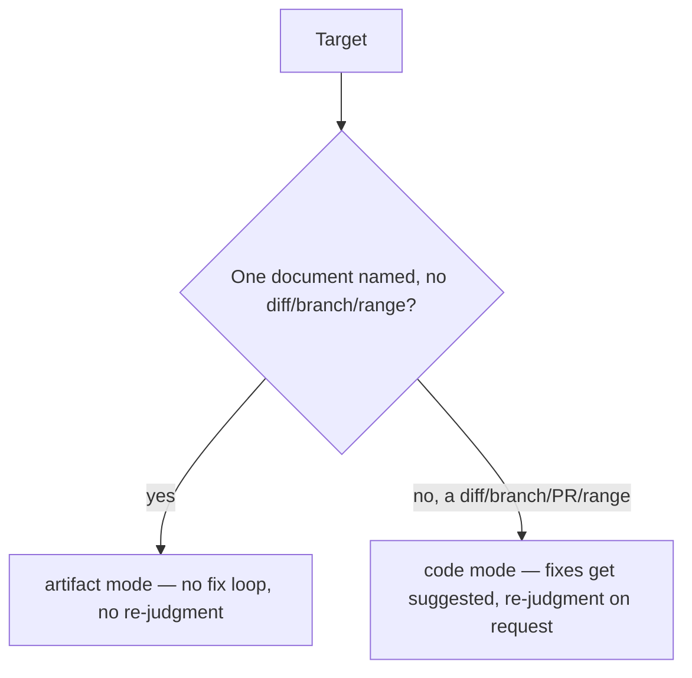

# judgment-day — usage

An adversarial dual review: two blind judges read the same frozen target independently, and only what
both of them agree on counts as confirmed. Built for the one review you want to trust more than usual,
not for routine checks.

## When to use it

- The decision is high-stakes enough that a single reviewer's mistake — missed, invented, or
  mis-scored — is a real cost, and you want two independent reads instead of one.
- You want disagreement surfaced, not smoothed over: if the two readings conflict, you decide, the skill
  never picks a side for you.

## When not to

- You want a routine review with one pass — that's a different skill (`code-review`), or a risk-sized
  single-lens pass (`4r-review`). Name `judgment-day` explicitly if two independent reviewers is what you
  actually want.
- You want feedback fast. Two full independent sweeps plus a merge costs more than one pass.

## How to invoke

Only by name or explicit request: `judgment-day`, "juicio final", or asking for two independent
reviewers on one target. It never starts on its own — a generic "judge this" or a request for a second
opinion is not enough by itself.

## What happens after you ask



Both judges review the frozen target independently — neither prompt tells either judge the other exists.
You never pick the mode; it's inferred from what you pointed at.

## What you'll be asked

One question, after the report: resolve any contradictions between the two judges, and optionally expand
a finding's evidence or save the review to a file. Nothing else interrupts — not before the report, not
after that one close.

## Minimal example

> "Juicio final de este PR" — a diff touching a payment retry handler

```
## Judgment Day — feature/payment-retry
**Mode:** code · **Frozen at:** a1b2c3d

### Confirmed (both judges)
| Id | Location | Severity | Claim |
|---|---|---|---|
| JD-001 | retry.ts:88 | CRITICAL | retry re-charges on a network timeout without an idempotency key |

### Suspects (one judge)
| Id | Judge | Location | Severity | Claim |
|---|---|---|---|---|
| JD-002 | judge-b | retry.ts:41 | WARNING | backoff has no jitter |

---
**TL;DR** — one confirmed double-charge risk in the retry path; one unconfirmed backoff note.
**Verdict:** ESCALATED
**Confirmed:** JD-001 `retry.ts:88`
**Needs your decision:** none
**Next step:** add an idempotency key before merging
```

---

For how convergence is computed, what a judge actually receives, and why it's shaped this way, see
[README.md](./README.md).
