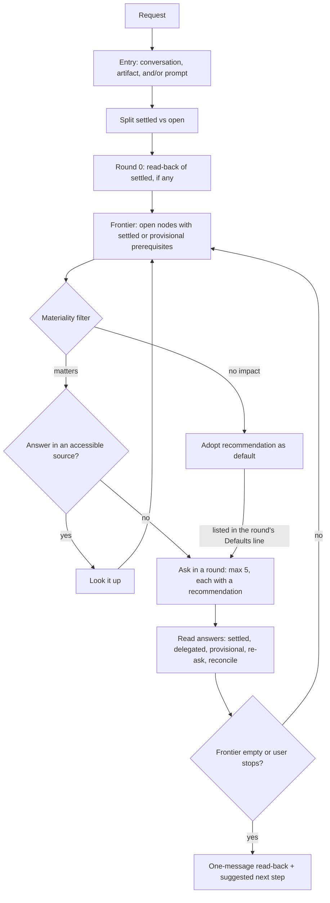

# grill-me

An interview that stress-tests a plan, design, or decision until the user and the agent share the same
understanding of it — asking only what matters, with a recommendation on every question, and never
stalling on a question the user cannot answer.

The work is separating facts from decisions, asking decisions in dependency order, keeping the number of
turns low, and making sure nothing ends up assumed without the user seeing it.

## Table of Contents

- [When it triggers](#when-it-triggers)
- [The flow](#the-flow)
- [Entry](#entry)
- [The tree and the frontier](#the-tree-and-the-frontier)
- [Rounds and answers](#rounds-and-answers)
- [Facts](#facts)
- [Provisional decisions](#provisional-decisions)
- [The close](#the-close)
- [Files](#files)
- [Why it is shaped this way](#why-it-is-shaped-this-way)
- [What it does not do](#what-it-does-not-do)

## When it triggers

Explicit invocation, or a request to be grilled or questioned about a plan, design, or decision
("grill me", "grillame", "question me about this plan", "preguntame", "hazme preguntas"). It suggests
itself — without starting — when the user wants to uncover assumptions or open decisions before acting.

Three things look similar and do not trigger it: questions meant for a third party, a request for an
opinion, and an invitation to ask whatever is needed to do a task.

## The flow



## Entry

Sources combine: the conversation so far, an artifact the user points to (plan, spec, ticket, diff,
document), and the prompt itself. Explicit decisions and what an artifact commits to are settled.
Hedged statements ("probably", "for now", "we'll see"), `TBD`/`TODO`, and options without a choice are
open. With only the prompt, nothing is settled and the tree starts at the root: what is being decided,
what it is for, and what is non-negotiable. A disagreement between sources is an open node of its own.

Round 0 is a single message: a one-line-per-item read-back of what is treated as settled, then the first
round. With nothing settled, the read-back is skipped.

## The tree and the frontier

Decisions form a tree: each one opens the decisions that only make sense once it is made. The frontier is
every open decision whose prerequisites are settled or provisional. A question that depends on another
open question in the same round waits, because a conditional answer settles nothing.

Two filters shape each round:

- **Materiality.** A node is asked only if a different answer would change what gets done, what it costs,
  or what it risks. Otherwise its recommendation is adopted, announced in the round's `Defaults:` line,
  and listed under `### Defaults` in the read-back.
- **Priority.** With more than five candidates: hardest to reverse first, then costliest if wrong, then
  most downstream decisions unblocked.

## Rounds and answers

Each question uses a fixed format — `❓ **Qn** - **title**: body` followed by `➡️ recommendation` — with a
body of one to three lines, one decision per question, and a concrete recommendation. Numbering continues
across rounds.

| The user... | Result |
|---|---|
| answers a question | settled |
| accepts the round ("ok") | every question settled on its recommendation |
| delegates one ("you decide") | settled on the recommendation, marked delegated |
| does not know | provisional |
| skips a question | re-asked once; skipped twice → provisional |
| contradicts a settled decision | earlier decision stands until one question reconciles them |

Each round ends with a `Defaults:` line naming what was adopted without asking, so it can be overturned
right away. Between rounds, one line of acknowledgement. From the third round on, each round offers to
wrap up; the user can stop at any time.

Questions, recommendations, and read-back content follow the user's language; the fixed markers (`Qn`,
❓/➡️) and the read-back headings stay in English.

## Facts

Anything an accessible source answers — the conversation, the files in the working environment, a shared
artifact — is looked up, not asked. External services and the web need the user's permission first.
Lookups never block a round: only the questions downstream of a pending lookup wait. With subagents,
lookups run in the background; without them, they stay short and inline. Subagents only find facts —
they never ask the user anything or decide.

## Provisional decisions

"I don't know" never blocks the interview. The question's recommendation becomes provisional, the
questions depending on it enter the frontier (saying in one clause that they build on a provisional
answer), and the read-back records what could confirm it: someone the user named, something to try, or
nothing identified yet. A provisional decision is never presented as decided.

## The close

One message, when the frontier is empty or the user stops:

- `## Shared understanding` with `### Decided`, `### Defaults`, `### Provisional`, and `### Not visited`
  (what was still open when the user stopped early) — empty sections omitted;
- one suggested next step, not started on its own.

Any agreement confirms the read-back and ends the interview. Picking the next step also confirms it and
counts as a request for that step, which then runs outside the skill. A correction is applied in the same
turn showing only the changed lines.

## Files

```
grill-me/
└── SKILL.md    the whole interview: entry, frontier, rounds, facts, provisional, close
```

## Why it is shaped this way

- **Facts are the agent's, decisions are the user's.** Asking what a file already says wastes a turn;
  deciding on the user's behalf defeats the interview.
- **Every question carries a recommendation.** Reacting to a proposal is faster and more precise than
  filling a blank, and it exposes the agent's own assumptions.
- **Only the frontier, at most five per round.** Asking a question whose prerequisite is still open forces
  a conditional answer; long rounds get the easy questions answered and the hard ones skipped.
- **Materiality before asking, visibility right away.** Asking everything makes the interview slow;
  assuming silently makes it untrustworthy. Low-impact decisions are adopted but announced in the same
  round, so later questions never build on a default the user would have overturned, and listed again in
  the read-back.
- **Nothing blocks.** A question the user cannot answer becomes provisional instead of pending, so the
  rest of the plan still gets explored, and the read-back stays honest about what is not truly decided.
- **One-message close.** The read-back and the next step travel together, and picking the step is the
  confirmation, so closing costs one turn and moving on costs none.
- **Standalone.** It relies on no other skill, project convention, or tool beyond reading accessible
  sources, so it works the same in any project and for non-technical decisions.

## What it does not do

- It does not write anything to disk or act on the plan during the interview.
- It does not start the suggested next step unless the user picks it.
- It does not ask what an accessible source already answers.
- It does not reach external services or the web without asking.
- It does not re-ask a settled decision unless the user reopens or contradicts it.
- It does not present a default or provisional decision as decided.
