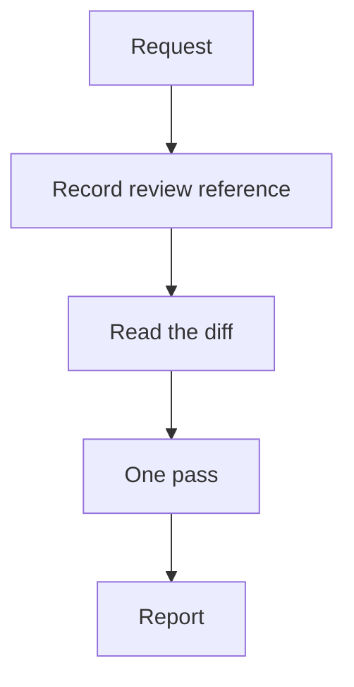

# standard-code-review

One evidence-based pass over a recorded git change. The output is a chat report with locations and
suggested fixes. Nothing is written: not code, not git, not a file.

The work is recording what is being reviewed, reading that diff, and reporting only defects that
can be pointed at. Side effects, edges, and duplication are in that same pass — bounded so they do
not become a second protocol.

The failure mode it exists to prevent is a review that is loud or vague: nits, design opinions, and
theoretical risks dressed as defects, or a questionnaire that runs before anyone opens the diff.

## Table of Contents

- [When it triggers](#when-it-triggers)
- [The flow](#the-flow)
- [What the pass looks for](#what-the-pass-looks-for)
- [The report](#the-report)
- [Files](#files)
- [Why it is shaped this way](#why-it-is-shaped-this-way)
- [What it does not do](#what-it-does-not-do)

## When it triggers

Explicit invocation, or a request to review code changes in a diff, commits, a branch, or a PR.
Prose, a file with no diff, and discussion of a review do not start it. There is no suggestion
trigger.

## The flow



The target is inferred, not asked about: what you named, else uncommitted changes, else the branch
against its base. One scope question fires only when that chain has nothing left to resolve.

Intent is inferred from the diff, commits, branch, and conversation. A remaining gap becomes
`Assumed: …` in the report, not a question.

Everything runs against the recorded reference — a commit SHA, a range resolved to SHAs, or a hash
of the working-tree diff.

## What the pass looks for

The list lives in `SKILL.md` Phase 3. The bounds are the point:

- **Side effects and edges** are checked only on paths this diff already touches. Tracing the
  module graph, or inventing a scenario the new code cannot reach, is out of scope — that is how a
  simple pass turns into a system review.
- **DRY** is copies this change introduced, visible in the diff or in a file already opened for a
  hunk. A repository-wide duplication search is out of scope, and an extract is suggested only when
  the copy is identical and both sides were touched.
- **Blocking** requires a named failure this change introduced, activated, or worsened. Everything
  else is a note or silence.

Over-engineering is not a finding. A local solution that works is left alone.

## The report

Compact, with the fix in the blocking row so there is no follow-up question.

| Part | What it carries |
|---|---|
| header | review reference, file and line counts |
| blocking table | id, location, claim, why it matters, smallest fix |
| notes | one line each — DRY, conventions, unfinished work the diff shows |
| **TL;DR, last** | what this change risks, in plain words, and the next step |

Empty sections are dropped. A clean review is one line naming what was inspected — an empty table
reads like a pass that failed to run.

## Files

```
standard-code-review/
└── SKILL.md    record · read · one pass · report
```

No `assets/` or `references/`. The pass is small enough to live in one file.

## Why it is shaped this way

- **Reference first.** Two runs over the same recorded diff review the same bytes.
- **Infer, then assume, then ask.** Target and intent are usually already in git or the
  conversation. Asking for them by default is friction; blocking the review on intent is worse.
- **One pass.** Side effects, edges, and DRY are look-fors on the hunks already in front of you,
  not extra workers. A second sweep would cost the simplicity this skill is for.
- **Critical, not exhaustive.** A weak finding trains the reader to skip the next one. Silence is
  the correct output when the evidence is thin.
- **The fix sits in the table.** On a small change there are few blocking rows; hiding the fix
  behind a question adds a round trip the report already owed.
- **Read-only.** Fixes are described and handed back.
- **No persisted state.** A later "look again" is a new review of the current reference, not round
  two of a protocol this skill does not have.

## What it does not do

- It does not apply fixes. Ever.
- It does not ask light vs deep, and it does not persist a ledger.
- It does not assess prose.
- It does not sweep the repository for callers, conventions, or duplication.
- It does not start from talk about a review, or from a file with no diff.
- It does not hand off to another review protocol. This pass is the whole run.
