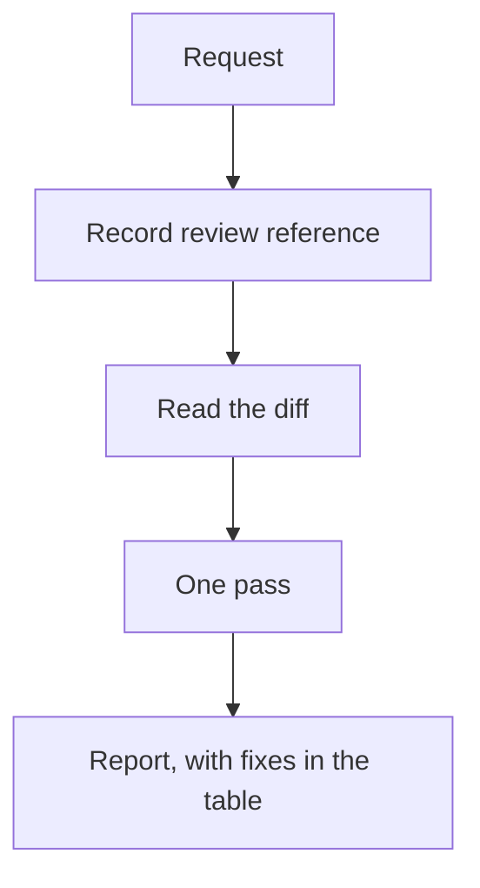

# standard-code-review — usage

One evidence-based pass over a git change: a diff, commits, a branch, or a PR. Findings come with a
location and a suggested fix. Built for small or controllable changes, not for an interview before
the review.

## When to use it

- You want a direct review of what changed, with concrete issues and a small fix for each.
- The change is small enough that one pass over the diff is enough.

## When not to

- The target is prose, not a git change.
- You want the change committed — this skill only reviews.

Note: `4r-review` and `judgment-day` are other review protocols in this set.

## How to invoke

By name (`standard-code-review`), or by asking to review the code changes in a diff, commits, a
branch, or a PR. It does not start on a file with no diff, on prose, or on talk about a review.

## What happens after you ask



The target is inferred: what you named, else uncommitted changes, else the branch against its base.
Nothing else is asked.

## What you'll be asked

Nothing, unless the target cannot be inferred — then one scope question.

## Minimal example

> "Revisá los cambios de esta rama" — a 40-line diff in checkout

```
## Code Review — feature/checkout-guest
**Reference:** a1b2c3d · **Scope:** 2 files, ~40 lines

### Blocking
| Id | Location | Claim | Why | Fix |
|---|---|---|---|---|
| CR-001 | checkout.ts:88 | guest order is created before payment confirmation | a timeout leaves a paid-looking order | create the order only after the payment ack |

---
**TL;DR** — guest checkout can persist an order on a payment timeout.
**Next step:** move order creation behind the payment ack
```

---

For what the pass looks for, and why it stays one pass, see [README.md](./README.md).
